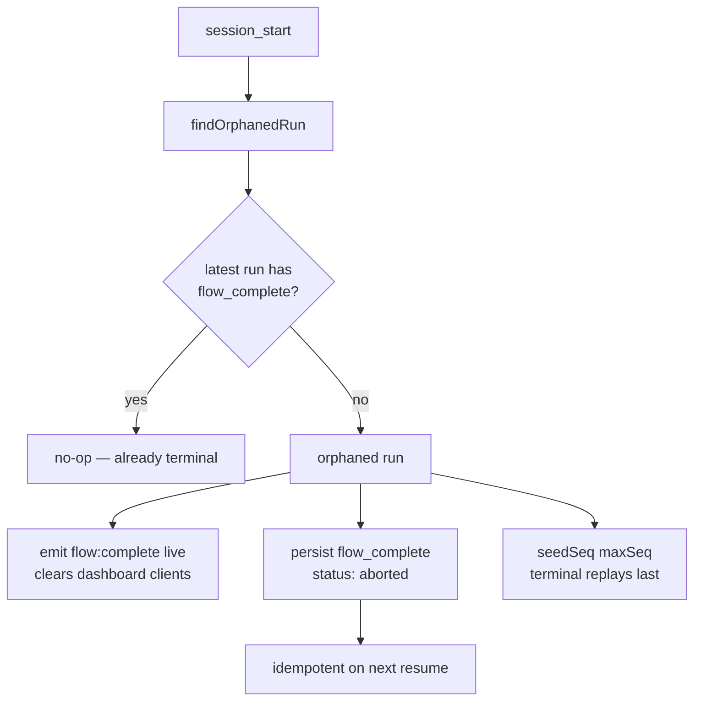

# pi-flows Architecture

> Internal design reference for pi-flows developers and package authors. User docs: [README.md](../README.md).

## System Overview

pi-flows: multi-agent workflow orchestration engine for [pi](https://github.com/badlogic/pi-mono). Discovers and loads packages at runtime from `package.json` manifests tagged with `pi-package` keyword. Provides DAG-based execution engine coordinating multiple AI agents.

Engine organized as cooperating sub-extensions activated through single entry point (`extensions/index.ts`). Shares one module graph and consistent state.

## Component Stack

```
┌─────────────────────────────────────────────────────────────┐
│                         User (TUI)                          │
│               /flow commands, interactive prompts            │
└────────────────────────────┬────────────────────────────────┘
                             │
┌────────────────────────────▼────────────────────────────────┐
│                      pi-flows Engine                        │
│                                                             │
│  ┌──────────────┐  ┌──────────────┐  ┌──────────────────┐  │
│  │ Flow Executor│  │ Agent Spawner│  │ Agent Dashboard   │  │
│  │              │  │              │  │ (TUI widget)      │  │
│  │ - DAG walk   │  │ - Process    │  │ - Card grid       │  │
│  │ - Branching  │  │   isolation  │  │ - Live metrics    │  │
│  │ - Loops      │  │ - Tool guard │  │ - Status tracking │  │
│  │ - Sub-flows  │  │ - Env inject │  │                   │  │
│  └──────────────┘  └──────────────┘  └──────────────────┘  │
│                                                             │
│  ┌──────────────────────────────────────────────────────┐   │
│  │                   Package Loader                     │   │
│  │  - Discovers pi-package dependencies                 │   │
│  │  - Loads extensions, skills, agents, flows           │   │
│  │  - Resolves namespaced flow commands (pkg:flow)      │   │
│  └──────────────────────────────────────────────────────┘   │
└─────────────────────────────┬───────────────────────────────┘
                              │
         ┌────────────────────┼────────────────────┐
         │                    │                    │
    ┌────▼────┐         ┌────▼────┐         ┌────▼────┐
    │ pkg-a   │         │ pkg-b   │         │ (other) │
    │         │         │         │         │         │
    │ agents/ │         │ agents/ │         │ agents/ │
    │ flows/  │         │ flows/  │         │ flows/  │
    │ skills/ │         │ skills/ │         │ skills/ │
    │ ext/    │         │         │         │ ext/    │
    └─────────┘         └─────────┘         └─────────┘
```

## Package Discovery

pi-flows engine discovers packages via npm dependency graph:

1. Scans `node_modules/` for packages with `"pi-package"` in `keywords`
2. Reads `"pi"` manifest from each package's `package.json`
3. Registers extensions, skills, prompts, themes from declared paths
4. Loads agents from `agents/` directories
5. Loads flows from `flows/<namespace>/` directories

```json
{
  "name": "my-domain-package",
  "keywords": ["pi-package"],
  "pi": {
    "extensions": ["./extensions/my-ext"],
    "skills": ["./skills"],
    "prompts": ["./prompts"],
    "themes": ["./themes"]
  }
}
```

## Agent Isolation Model

Each agent runs as in-process isolated session with controlled capabilities:

```
┌──────────────────────────────────────────────────┐
│ Parent Process (pi-flows engine)                 │
│                                                  │
│  spawnAgent(agentDef, task, inputs)              │
│    │                                             │
│    ├── Serialize AGENT_ALLOWED_TOOLS → env       │
│    ├── Inject context files                      │
│    ├── Wire inputs from upstream results         │
│    └── Create agent session                       │
│                                                  │
│  ┌────────────────────────────────────────────┐  │
│  │ Agent Session (isolated)                      │  │
│  │                                            │  │
│  │  ┌─────────┐  ┌──────────┐                │  │
│  │  │ Guard   │  │ Agent    │                │  │
│  │  │         │  │ Prompt   │                │  │
│  │  │ - Tool  │  │ (from    │                │  │
│  │  │   allow │  │  .md)    │                │  │
│  │  │ - File  │  │          │                │  │
│  │  │   access│  │ ${{task}}│                │  │
│  │  │ - Bash  │  │ ${{input │                │  │
│  │  │   deny  │  │    .x}}  │                │  │
│  │  └─────────┘  └──────────┘                │  │
│  │                                            │  │
│  │  → Produces <result> on finish             │  │
│  └────────────────────────────────────────────┘  │
└──────────────────────────────────────────────────┘
```

### Guard Layers

1. **Tool scoping** — `AGENT_ALLOWED_TOOLS` env var parsed into Set. Only declared tools + `finish` permitted.
2. **File access** — `access.read` and `access.write` glob patterns control filesystem ops.
3. **Bash deny list** — `access.bash.deny` patterns block specific shell commands.
4. **Agent extensions** — domain packages register additional extensions (guards, provider middleware, custom tools) into spawned agent sessions via `flow:register-agent-extension`.

## Flow Execution Model

Flow executor walks DAG of steps, manages parallelism and control flow:

### DAG Segment Execution

```
1. Initialize: completed = {}, running = {}, results = {}
2. Loop:
   a. Find unblocked steps: blockedBy ⊆ completed
   b. Filter by activeSteps (if branch exclusivity applies)
   c. Limit by max_concurrent
   d. Spawn agent processes for unblocked steps
   e. Wait for any completion
   f. Store result, add to completed set
   g. If all steps completed or error → exit loop
```

### Control Flow Primitives

**Fork (user decision):**
```
Fork step → present options to user → user selects → route to branch step(s)
                                                   → skip non-selected branches
```

**Agent Decision (agent routing):**
```
Agent decision step → agent calls finish({ branch }) → route to branches[branch] target
                                                     → backward branch loops (max_iterations safety limit)
```

**Code Decision (handler routing):**
```
Code decision step → handler returns { branch } → route to branches[branch] target
                                                → backward branch loops (max_iterations safety limit)
```

### Result Propagation

Results flow through DAG via interpolation:

```
Step A produces:
  { status: "complete", summary: "...", fullOutput: "...", outputs: { record: { id: 1 } } }

Step B references:
  task: "Use this: ${{result.step-a.summary}}"
  inputs:
    data: "${{result.step-a.record}}"   # whole-value ref → handler gets the object { id: 1 }
```

## Sub-Extension Activation Order

Sub-extensions load through single entry point (`extensions/index.ts`). Share one `jiti` module graph. Eliminates module identity issues from dynamic imports creating separate instances. Activation order:

```
1. provider-register  — Model roles (@coding, @planning, etc.) and provider management
2. file-tracker       — Tracks file edits/writes in the main session for footer stats
3. flow-engine        — Discovery, DAG execution, agent spawning, tool registration
4. flow-dashboard     — TUI card grid, navigation, workflow breadcrumbs
5. flow-summary       — Post-flow summary widget with expandable step results
6. flow-context       — #flows: inline reference and flow_results tool for main session
7. flow-footer        — Footer segments: provider, git, file stats, context usage
```

## Extension Lifecycle

Extensions hook into pi-coding-agent lifecycle:

```
1. Package loaded (npm dependency graph scan for "pi-package" keyword)
2. Extension module imported via jiti
3. default export function called with ExtensionAPI
4. Extension registers:
   - Commands (pi.registerCommand)
   - Event handlers (pi.on / pi.events.on)
   - Tools (pi.registerTool)
   - Flow events (pi.events.emit "flow:register-*")
5. session_start fires:
   - Session auth/model storage captured
   - TUI adapter wired (if ctx.hasUI)
6. Events fire during agent execution:
   - "tool_call" → guard can block
   - flow:subagent-tool-call → observation
   - flow:subagent-tool-result → observation
7. Flow completes:
   - flow:complete → FlowResult emitted
   - Summary widget rendered
8. Cleanup on session end
```

## Flow Lifecycle on Session Close & Resume Reconciliation

Flow runs in-process in parent pi session. `FlowManager` holds in-memory promise + `AbortController`. Subagents are in-memory sessions. Closing parent session destroys all mid-run. No checkpoint. No graceful-shutdown hook. Flows NOT resumable — executable state never re-driven.

Durable trace = persisted `flow-event` stream. `FlowEventPersister` writes one entry per lifecycle event: `{ seq, eventType, data, flowRunId }`. Terminal `flow_complete` record written only when in-process promise settles. Hard kill leaves stream with NO terminal record.

Old behavior: resume replays non-terminal stream. Flow card hangs on "running" forever. Abort button no-op — `flow:abort` handler gated by `if (flowManager.isRunning)`, false on resumed session.

### Run identity

Run id minted ONCE per run by `FlowManager.start()`, before its first `await`, co-located with atomic single-run guard — claim on session + identity of claiming run established together. Exposed as `flowManager.activeRunId`. Handed to every observer as first parameter of `onFlowStarted(runId, flowName, flow, task)`. `EventEmitObserver` stamps it onto every live `flow:*` payload — hence `runId` present in headless/RPC sessions, not only TUI.

`FlowEventPersister` no longer self-mints `flowRunId` on `flow:flow-started`. Records SUPPLIED id carried on payload. Persisted `flowRunId` = same string as `runId` on live events — durable stream and live stream correlatable.

Orphan-reconciliation path = one deliberate exception, PRESERVED unchanged. Runs when no live run exists, so injects explicit id via `persistTerminal(orphanId, …)` instead of reading live handle.

### Resume-time reconciliation

`session_start` scans persisted `flow-event` entries via `findOrphanedRun()`.

1. Group records by `flowRunId`. Pick latest run (highest `seq`).
2. Run lacks `flow_complete` record → orphaned.
3. Orphaned run → synthesize terminal event. Emit `flow:complete` live (clears connected dashboard clients). Persist `flow_complete` record tagged with orphaned run `flowRunId` (next cold resume idempotent). Synthesized `FlowResult` has `status: "aborted"`, summary `"Flow interrupted — parent session closed"`.
4. Seed resumed persister `seq` counter past orphan max `seq` via `seedSeq(maxSeq)`. Synthesized terminal record replays AFTER mid-run events. Ordering correctness.

`flow:abort` handler reconciles when no live flow:

```
if (flowManager.isRunning) flowManager.abort();
else reconcileOrphanedFlow("user-abort");   // summary: "Flow aborted (no live run)"
```

Reconciliation idempotent. Run has `flow_complete` record (clean completion, prior resume reconciliation, abort reconciliation) → no longer orphaned.



No dashboard-side code change required. Synthesized `flow_complete` rides existing replay/reducer path. Non-goals: no re-driving executable state, no `SIGTERM` handler.

## FlowManager Architecture

`FlowManager` class: central orchestration component. Adapter pattern decouples execution logic from UI:

```
┌──────────────────────────────────────────────────┐
│ FlowManager                                      │
│                                                  │
│  ┌─────────────────┐  ┌───────────────────────┐  │
│  │ FlowIOAdapter   │  │ FlowObserver[]        │  │
│  │ (pluggable)     │  │ (pluggable)           │  │
│  │                 │  │                       │  │
│  │ - askUser()     │  │ - onFlowStart()       │  │
│  │ - notify()      │  │ - onAgentStarted()    │  │
│  │ - selectFlow()  │  │ - onAgentComplete()   │  │
│  └─────────────────┘  │ - onFlowComplete()    │  │
│                       │ - onToolCall/Result()  │  │
│                       └───────────────────────┘  │
│                                                  │
│  Adapters:              Observers:               │
│  - TuiFlowIOAdapter     - TuiFlowObserver        │
│  - HeadlessFlowIOAdapter- EventEmitObserver       │
└──────────────────────────────────────────────────┘
```

At startup: `HeadlessFlowIOAdapter` wired. On `session_start` (if `ctx.hasUI`): upgrades to `TuiFlowIOAdapter`, adds `TuiFlowObserver`.
