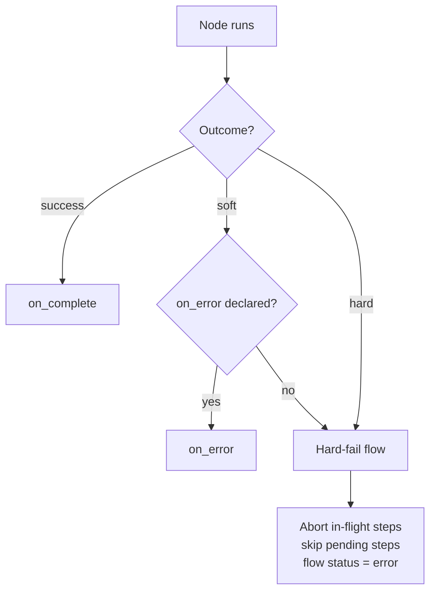
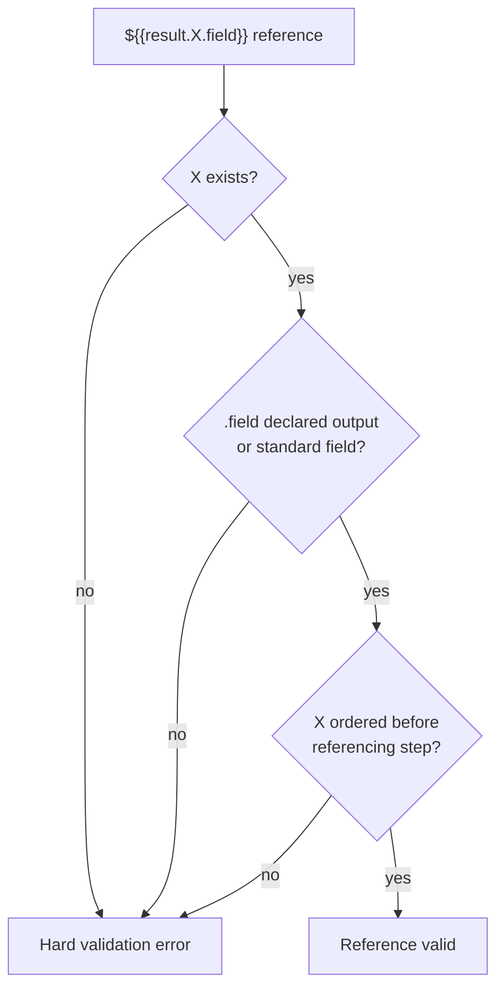

# Flow Reference

Complete reference for authoring flows in pi-flows. Covers all step types: syntax, field references, practical examples.

---

## Flow File Format

Flows: `.yaml` files with YAML frontmatter followed by step definitions. Each step has unique `id`, connects to other steps via `blockedBy` declarations to form DAG.

**Location:** `.pi/flows/flows/<name>.yaml` or package-registered flows directory.

---

## Flow Frontmatter

```yaml
---
name: research-and-build
description: Research the codebase then implement changes
max_concurrent: 2
task_required: true
task_prompt: "What feature should I research and implement?"
inputs:
  ref:   { type: string, required: true }
  count: { type: number }
---
```

| Field | Required | Description |
|-------|:--------:|-------------|
| `name` | ✓ | Flow identifier — for documentation; the slash command is derived from the file path |
| `description` | ✓ | What the flow does (shown in command list and dashboard) |
| `max_concurrent` | | Maximum agents running in parallel (default: `4`) |
| `task_required` | | When `true`, prompts the user for a task if none was provided |
| `task_prompt` | | Custom prompt text shown when asking for a task |
| `inputs` | | Optional typed input schema (see [Typed Flow Inputs](#typed-flow-inputs)) |

### Typed Flow Inputs

Optional `inputs:` schema — mapping name → `{ type, required? }`. `type` is one of `string`, `number`, `boolean`, `object`, `array` (omitted/unknown → validation error); `required: true` fails the run start when absent.

```yaml
inputs:
  ref:   { type: string, required: true }
  count: { type: number }
```

A run accepts a structured `inputs` object alongside `task` across every path (slash command, `flow:run` event's `inputs` field, programmatic run API). Provided inputs validated against schema — missing `required` or type mismatch fails the run start. A flow with no `inputs:` schema is still startable with only `task`. Referenced as `${{flow.input.<name>}}`; same typed-delivery rules as result outputs (typed to code handlers as a whole value, JIT-serialized to compact JSON in text).

> **Command name = file path, not `name:` field.** Slash command derived from file path:
>
> | File path | Command |
> |-----------|---------|
> | `.pi/flows/flows/research.yaml` | `/research` |
> | `.pi/flows/flows/my-domain/apply.yaml` | `/my-domain:apply` |

---

## Step Types

Steps form DAG based on `blockedBy` declarations. pi-flows schedules steps with no pending dependencies in parallel, respecting `max_concurrent`.

### Agent Step

Dispatches named agent with task. Most common step type.

**Syntax:**

```yaml
steps:
  - id: my-step
    agent: agent-name
    task: Optional task override with ${{template}} variables
    blockedBy: [step-a, step-b]
    inputs:
      input_name: "${{result.step-a.summary}}"
    on_complete: next-step
    on_error: error-handler
```

**Field reference:**

| Field | Description |
|-------|-------------|
| `id` | **Required.** Unique step identifier |
| `agent` | **Required.** Agent name to dispatch |
| `task` | Task override (template string). If omitted, uses the flow's task |
| `blockedBy` | Array of step IDs that must complete before this step starts |
| `inputs` | Named inputs wired from template expressions |
| `on_complete` | Step ID to route to on success |
| `on_error` | Step ID to route to on error |

**Example — parallel research with fan-in:**

```yaml
name: multi-research
description: Research multiple domains in parallel

steps:
  - id: backend-research
    agent: researcher
    task: Investigate backend patterns for ${{task}}

  - id: frontend-research
    agent: researcher
    task: Investigate frontend patterns for ${{task}}

  - id: synthesizer
    agent: synthesizer
    blockedBy: [backend-research, frontend-research]
    inputs:
      backend: "${{result.backend-research.summary}}"
      frontend: "${{result.frontend-research.summary}}"
    task: Synthesize findings from both research passes
```

---

### Fork Step

Pause execution, present options to user. Selected option determines which branch runs.

**Syntax:**

```yaml
  - id: choose-approach
    type: fork
    question: "Which approach do you prefer?"
    options: [Quick fix, Full refactor]
    branches:
      Quick fix: quick-fix-step
      Full refactor: refactor-step
    allowCustom: true
    agent: router-agent
```

**Field reference:**

| Field | Required | Description |
|-------|:--------:|-------------|
| `question` | ✓ | Question displayed to the user |
| `options` | ✓ | Comma-separated or YAML list of choices |
| `branches` | ✓ | Map of option text → step ID |
| `allowCustom` | | Appends "Other (describe)" option. Custom freetext routes through the fork's `agent`. Requires `agent`. |
| `multiSelect` | | Allow selecting multiple options. All selected branches run sequentially. |
| `agent` | | Agent for autonomous decisions (alt+a) and custom freetext routing. Required when `allowCustom` is set. |
| `task` | | Task description for the decision agent. Defaults to question + options. |

**Behavior:**

- **Single-select:** Routes to one branch. Unselected branches skipped (synthetic "skipped" results stored).
- **Multi-select:** Multiple branches run in parallel.
- **After selection:** User prompted for optional notes (Enter to skip). Fork context **automatically injected** into branch step's system prompt.

**Autonomous mode:** When alt+a active, fork steps with `agent:` field skip user prompt, let agent decide automatically. Forks without `agent:` always prompt user.

---

### Code Decision Step

Runs TypeScript handler like code step. Routes on reserved `branch` output. Deterministic routing. No agent.

**Syntax:**

```yaml
  - id: route-approval
    type: code-decision
    inputs:
      score: "${{result.reconcile.score}}"
    outputs:
      - name: approvers      # optional data outputs (never `branch`)
    branches:
      auto_approve: export
      needs_human: human-review
      park: hold
```

**Field reference:**

| Field | Required | Description |
|-------|:--------:|-------------|
| `id` | ✓ | Unique step id. Determines handler filename. Filesystem-safe. |
| `type` | ✓ | Must be `code-decision`. Not inferred. Always explicit. |
| `branches` | ✓ | Map branch label → target step id. Declares ≥2 branches. |
| `inputs` | | Map name → `${{...}}` template. Same as code step. |
| `outputs` | | Optional data outputs. Never `branch` — reserved. |
| `target` | | Override handler path. No scaffold. |
| `blockedBy` | | Step ids that complete first. |
| `max_iterations` | | Required when branch target points to earlier step (loop). See Loops. |
| `timeout` | | Soft deadline ms. Expiry aborts `ctx.signal`, soft-fails. |

**Handler contract:**

Same as code step. Same handler path `.pi/flows/handlers/<flow>/<id>.ts` or `target:`. Same `inputs`/`outputs`, soft/hard failure model, value coercion. Handler returns reserved `branch: string` key.

```typescript
import type { CodeNodeContext } from "@blackbelt-technology/pi-flows";

interface Input  { score: string }
type Branch = "auto_approve" | "needs_human" | "park";
interface Output { approvers: string }

export default async function (
  input: Input,
  ctx: CodeNodeContext,
): Promise<{ branch: Branch } & Output> {
  const score = Number(input.score);
  if (score >= 0.9) return { branch: "auto_approve", approvers: "alice,bob" };
  if (score >= 0.5) return { branch: "needs_human", approvers: "" };
  return { branch: "park", approvers: "" };
}
```

- `branch` resolves against `branches:` map. Flow routes to mapped step.
- `branch` reserved. Declaring output named `branch` → validation error.
- Data outputs follow normal code-step return contract.

**Validation and failure rules:**

| Condition | Outcome |
|-----------|---------|
| Fewer than 2 `branches` | Validation error. Use plain `code` step with `on_complete`. |
| `branch` in `outputs:` | Validation error. `branch` reserved. |
| Return omits `branch` | Soft failure naming reserved `branch` output. |
| `branch` not in `branches:` | **Hard** failure. Halts flow. Consistent with `agent-decision`. |
| Any code-step failure (throw, contract, timeout) | Soft failure. Routes `on_error`, else hard-fails. |

**Type-safe scaffold:** `/flows:generate` emits `type Branch = "auto_approve" | "needs_human" | "park";` per `code-decision`. Types return `Promise<{ branch: Branch } & Output>`. Off-map label → compile-time error. Scaffolds write `.ts.default`. Never overwrite implemented handler.

**Migrating from `conditional`:** Replace `type: conditional` with `type: code-decision`. Read `check: <stepId>.<key>` value as handler input. Return `{ branch: "present" }` or `{ branch: "absent" }`. Set `branches: { present: <present-target>, absent: <absent-target> }`. Standard fields (`summary`, `status`, `fullOutput`) available as `${{result.<stepId>.<field>}}` inputs.

---

### Agent Decision Step

Delegate routing decision to agent. Agent analyzes context, calls `finish` with `branch` name.

**Syntax:**

```yaml
  - id: route-decision
    type: agent-decision
    agent: router-agent
    task: "Review and decide: ${{result.analyzer.summary}}"
    branches:
      needs-work: fix-step
      ready: deploy-step
```

**Field reference:**

| Field | Required | Description |
|-------|:--------:|-------------|
| `agent` | ✓ | Agent name — must call `finish` with a valid `branch` |
| `task` | ✓ | Task for the decision agent. Supports template variables. |
| `branches` | ✓ | Map of branch names → step IDs |
| `max_iterations` | | Required when branch target points to earlier step (loop). See Loops. |

**Agent finish call:**

```
finish(summary="Quality is sufficient.", branch="ready")
```

`branch` not in `branches` → flow hard-fails. `agent-decision` loops by pointing branch at earlier step. See Loops.

---

### Loops

Loop = `*-decision` node (`agent-decision` or `code-decision`) with branch target pointing to earlier step. Re-enters graph. Forms cycle. No dedicated loop step type. Loop = backward branch edge.

**Rules:**

- `*-decision` node with branch target pointing to earlier step MUST declare `max_iterations`.
- Engine tracks per-node iteration counts. Forces exit at cap. Control falls through to next step.
- `*-decision` node with all branches forward needs no `max_iterations`.
- Dashboard ↻ iteration badge driven by `flow:loop-iteration` event. Emitted only when backward edge taken. Not inferred from `max_iterations`.

**Agent-driven verify/fix loop:**

```yaml
steps:
  - id: developer
    agent: developer
    task: Implement ${{task}}

  - id: verify-loop
    type: agent-decision
    agent: verifier
    task: >
      Check implementation (attempt ${{loop.verify-loop.iteration}}/${{loop.verify-loop.max}}).
      Developer output: ${{result.developer.summary}}
    branches:
      rework: developer      # backward edge → loop
      done: finalize         # forward edge → exit
    max_iterations: 3

  - id: finalize
    agent: summarizer
    task: Summarize the completed implementation
```

Agent calls `finish(branch="rework")` to loop back to `developer`. Calls `finish(branch="done")` to exit. Label resolves against `branches:`. `code-decision` loops same way — handler returns `{ branch: "rework" }`.

**Migrating from `agent-loop-decision`:** Replace `type: agent-loop-decision` with `type: agent-decision`. Move `loop_target` and `exit_target` into `branches:` (e.g. `branches: { rework: <loop_target>, done: <exit_target> }`). Keep `max_iterations`. Agent calls `finish(branch="rework")` or `finish(branch="done")`.

---

### Routing Node Semantics

Routing node (`fork`, `agent-decision`, `code-decision`) always executes. Own outputs always populated. Loop node outputs reflect LAST iteration. Forward branches not taken get synthetic `skipped` results. Unresolved `${{result.<id>.<field>}}` expands to empty string. Never `undefined`.

---

### Code Step

Execute TypeScript handler function in-process. No agent or LLM dispatch.

**Syntax:**

```yaml
  - id: validate
    type: code
    inputs:
      data: "${{result.fetcher.record}}"
    outputs:
      - name: is_valid
      - name: error_message
    on_complete: next-step
    on_error: error-handler
    timeout: 30000
```

**Field reference:**

| Field | Required | Description |
|-------|:--------:|-------------|
| `id` | ✓ | Unique step identifier. Filesystem-safe. Becomes handler filename. |
| `type` | ✓ | Must be `code`. |
| `inputs` | | Map of name → `${{...}}` template expression. A **whole-value** reference (`${{result.X.name}}` / `${{flow.input.name}}`, no surrounding text) arrives unchanged in its real JSON type; an embedded reference arrives as the interpolated (JIT-serialized) string. Unresolved → `""`. Never `undefined`. |
| `outputs` | | List of `{ name }` objects. Names unique, valid JS identifiers. Optional — omit for side-effect-only steps. |
| `target` | | Override handler file path. Steps with `target` get no generated scaffold. |
| `blockedBy` | | Array of step IDs that must complete before this step runs. |
| `on_complete` | | Step ID to route to on success. |
| `on_error` | | Step ID to route to on error. |
| `timeout` | | Milliseconds. Soft deadline — aborts `ctx.signal` on expiry → soft failure. |

**Handler locations:**

| File | Purpose |
|------|---------|
| `.pi/flows/handlers/<flow>/<id>.ts` | Real handler (implement here) |
| `.pi/flows/handlers/<flow>/<id>.ts.default` | Generated scaffold — `.default` suffix makes it un-importable (inert) |

Copy `.ts.default` → remove `.default` suffix → implement. Scaffold always regenerated on flow save or `/flows:generate <name>`. Real `.ts` never touched by generation. `target:` steps get no scaffold.

**Handler contract:**

```typescript
import type { CodeNodeContext } from "@blackbelt-technology/pi-flows";

interface Input  { data: Record<string, unknown> }                   // whole-value ref → real JSON type
interface Output { is_valid: boolean; error_message: string }        // one key per declared output (any JSON type)

export default async function (input: Input, ctx: CodeNodeContext): Promise<Output> {
  ctx.logger("validating...");
  ctx.setSummary("Validation complete");
  return { is_valid: true, error_message: "" };
}
```

**`CodeNodeContext` fields:**

| Field | Type | Description |
|-------|------|-------------|
| `signal` | `AbortSignal` | Aborted when `timeout` expires. Check cooperatively in loops. |
| `cwd` | `string` | Project root directory. |
| `logger(msg)` | `(msg: string) => void` | Stream text to step card. |
| `setSummary(text)` | `(text: string) => void` | Set step summary shown after completion. |
| `flowName` | `string` | Name of the running flow. |
| `stepId` | `string` | This step's `id`. |
| `task` | `string` | The flow task string. |

**Return rules:**

- Return exactly declared outputs. All keys present. No extras (missing/extra key → soft failure).
- No `outputs:` declared → return `{}`.
- A handler may return **any JSON-compatible value** (`string`/`number`/`boolean`/`object`/`array`/`null`) per declared output. Stored in its real type under the result's `outputs` — no string coercion; `object`/`array`/`null` is **no longer** a soft failure.

**Failure modes:**

| Cause | Outcome |
|-------|---------|
| Plain `throw` (any `Error`) | `soft` — routes `on_error`, else hard-fails flow |
| Contract violation (wrong/missing output keys) | `soft` |
| Missing handler file | `soft` |
| Timeout expired | `soft` |
| `throw new FlowHardError(msg)` | `hard` — stops flow regardless of `on_error` |

No retry layer. Execution in-process via jiti dynamic import. No subprocess.

**Drift detection:**

If real handler's `Input`/`Output` interfaces mismatch YAML `inputs`/`outputs` — non-fatal WARNING at generation time. Never blocks execution.

**Presence routing with code-decision:**

`code-decision` handler reads `${{result.stepId.outputName}}` as input. Routes on presence. Typed output resolves from merged result map. Falls back to `fullOutput` only when key absent. Standard fields (`summary`, `status`, `fullOutput`) resolved as normal.

---

## Failure Modes

Node resolves to one outcome: `success` | `soft` | `hard`. Outcome decides routing.

| Outcome | Meaning | Routing |
|---------|---------|---------|
| `success` | Node completed work | Routes `on_complete` |
| `soft` | Recoverable failure. Node ran, reported logical problem | Routes `on_error` |
| `hard` | Unrecoverable failure | Aborts in-flight parallel steps, skips pending steps, ends flow status `error`, surfaces message |



### `on_error` = soft switch

`soft` routes `on_error` when node declares one. `soft` + no `on_error` → hard-fails flow. Fail-fast by default. Unhandled recoverable failure stops flow.

> **⚠️ BREAKING.** Previously: failure + no `on_error` → silent-continue. Now: hard-fails flow. Flows relying on silent-continue must add explicit `on_error`.

### Agent failure classification

Agent classified structurally. No error-message parsing. No deliberate fatal signal.

| Agent end state | Outcome |
|-----------------|---------|
| `finish(status:"complete")` | `success` |
| `finish(status:"error")` or `finish(status:"blocked")` | `soft` (ran, reported logical failure) |
| No `finish` + terminal API error (pi-coding-agent auto-retries exhausted: rate limit, quota, auth) | `hard` (provider unusable rest of flow) |
| No `finish` + no API error | `soft` |

No-finish reminder capped at 2. Reminders include `finish` tool-call format. Still no finish → clean `soft` failure. Never `status:"unknown"`. Never infinite loop.

### Transient retry delegated to pi

pi-coding-agent auto-retries transient errors (rate limit, 5xx, overloaded, network, timeout) with exponential backoff. pi-flows adds no redundant retry layer. Error reaching flow engine is terminal.

### Code / extension nodes

Thrown error decides outcome.

| Thrown | Outcome |
|--------|---------|
| Plain `throw` (any `Error`) | `soft` — routes `on_error` if declared, else hard-fails |
| `throw new FlowHardError(msg)` | Unconditional `hard` — stops flow regardless of `on_error` |

`FlowHardError` exported from package. See [public-api.md](./public-api.md) for shape and usage.

---

## Template Variable Reference

Template variables: placeholders in `task`, `inputs`, `question` fields. Expanded just before agent dispatched.

| Variable | Resolves To |
|----------|-------------|
| `${{task}}` | The task passed when the flow was invoked |
| `${{input.NAME}}` | A wired input value (from the `inputs:` block) |
| `${{result.STEP-ID}}` | Full raw output from a completed step |
| `${{result.STEP-ID.summary}}` | Summary from `finish(summary:)` |
| `${{result.STEP-ID.status}}` | Status: `complete`, `error`, or `blocked` |
| `${{result.STEP-ID.<outputName>}}` | A declared typed output (agent or code step), held under the result's `outputs` in its real JSON type. A produced file path is conveyed as a `*_path` output. |
| `${{flow.input.NAME}}` | A declared flow input (see [Typed Flow Inputs](#typed-flow-inputs)) |
| `${{loop.STEP-ID.iteration}}` | Current iteration (1-based) in a loop step |
| `${{loop.STEP-ID.max}}` | Maximum iterations configured for a loop |

> **Resolution order:** Variables expand at dispatch time. `${{result.X}}` only valid if step `X` already completed (guaranteed when `X` is in `blockedBy`).

> **Missing value at runtime resolves to empty string.** Reference surviving validation but no value at dispatch expands to `""`. Reference correctness checked ahead of time — see below.

---

## Reference Validation

`validateFlowContent` checks every `${{result.X}}` and `${{result.X.field}}` at flow-load time. Invalid reference -> hard validation error. Blocks flow. No agent dispatched until fixed. Catches typos and broken wiring early. Does not silently expand to `""`.

Three rules:

**1. Step must exist.** Reference unknown step id -> hard validation error. Blocks flow.

**2. `.field` must resolve.** Agent and code steps: `.field` must be declared output (agent `outputs:` or code-step `outputs:`) OR standard field. Standard fields always resolve: `summary`, `status`, `fullOutput`. `.field` neither declared output nor standard -> hard validation error.

**3. Referenced step must be ordered first.** `${{result.X}}` valid only if X guaranteed to complete before referencing step. Guarantee holds when X is transitive `blockedBy` ancestor OR X routes into referencing step via `on_complete` / `on_error` / branch / loop edge chain. Neither path -> hard validation error.

> **Engine does not auto-add dependency.** Ordering fails -> author adds `blockedBy: [X]` or routing edge. pi-flows reports missing ordering as error. Never silently wires it.



### Loop iteration 1-based

`${{loop.STEP.iteration}}` 1-based. Consistent across loop. First body pass observes `iteration == 1` (not `0`). Body pass N and loop-decision step both observe `${{loop.STEP.iteration}} == N`.

---

## Input Wiring

Inputs wire specific data from one step to another as named variables, separate from task text.

### Declare on the agent

```yaml
# agents/developer.md
inputs:
  - research_output
  - ticket_context
```

### Wire in the flow step

```yaml
  - id: developer
    agent: developer
    blockedBy: [researcher]
    inputs:
      research_output: "${{result.researcher.summary}}"
      ticket_context: "${{result.ticket-fetch.ticket}}"
```

### Reference in the system prompt

```markdown
Research context:
${{input.research_output}}

Ticket context:
${{input.ticket_context}}
```

If `inputs:` not declared in agent's frontmatter, input values substituted but system prompt has no `${{input.NAME}}` to expand them into.

### Passing File-Backed Data

Engine does **not** read a file and inject its content — the `file://` input prefix is no longer a special form. Pass the file's **path** (typically a `*_path` output); the consumer reads it just-in-time via its `read` tool (agent, subject to `access.read`) or the filesystem (code node):

```yaml
  - id: summarize
    agent: summarizer        # must declare the `read` tool
    blockedBy: [writer]
    inputs:
      report_path: ${{result.writer.report_path}}
```

The prompt instructs the agent to read: `Read the report at ${{input.report_path}}.`

**Rules:**
- Producing step **MUST** be in `blockedBy` so the file exists when the consumer reads it.
- Consuming agent needs the `read` tool + matching `access.read` glob. Flow validation **warns** when a `*_path`/`*_file` input is wired into an agent lacking `read`.
- For small, always-needed files, `context_files` (read at spawn) remains available.

---

## Common Flow Patterns

### Research → Plan → Execute

```yaml
name: research-and-build
description: Research, plan, then implement

steps:
  - id: research
    agent: researcher
    task: Investigate the codebase for ${{task}}

  - id: planner
    agent: planner
    blockedBy: [research]
    task: Create an implementation plan based on: ${{result.research.summary}}

  - id: implementer
    agent: developer
    blockedBy: [planner]
    inputs:
      plan: "${{result.planner.summary}}"
    task: Implement the plan. Details: ${{input.plan}}
```

### Interactive Branching

```yaml
name: flexible-workflow
description: User-driven workflow selection

steps:
  - id: choose
    type: fork
    question: "How thorough should the analysis be?"
    options: [Quick scan, Deep analysis]
    branches:
      Quick scan: quick
      Deep analysis: deep

  - id: quick
    agent: quick-scanner
    task: Quick scan of ${{task}}

  - id: deep
    agent: deep-analyzer
    task: Deep analysis of ${{task}}

  - id: report
    agent: reporter
    blockedBy: [quick, deep]
    task: Generate report from analysis results
```

### Verify-Fix Loop

```yaml
name: implement-and-verify
description: Implement with verification loop

steps:
  - id: implement
    agent: developer
    task: Implement ${{task}}

  - id: verify
    agent: verifier
    blockedBy: [implement]
    task: Verify the implementation

  - id: verify-loop
    type: agent-decision
    agent: flow-decision
    task: "Evaluate: ${{result.verify.summary}}"
    branches:
      rework: implement     # backward edge → loop
      done: done            # forward edge → exit
    max_iterations: 3

  - id: done
    agent: summarizer
    task: Summarize the completed work
```
