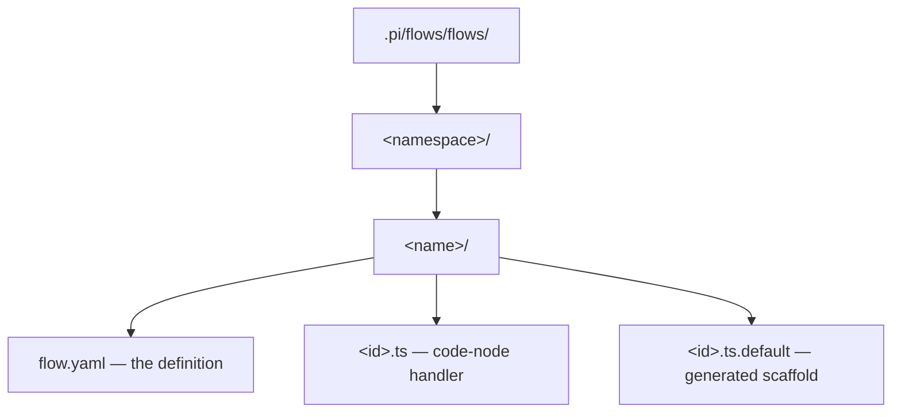
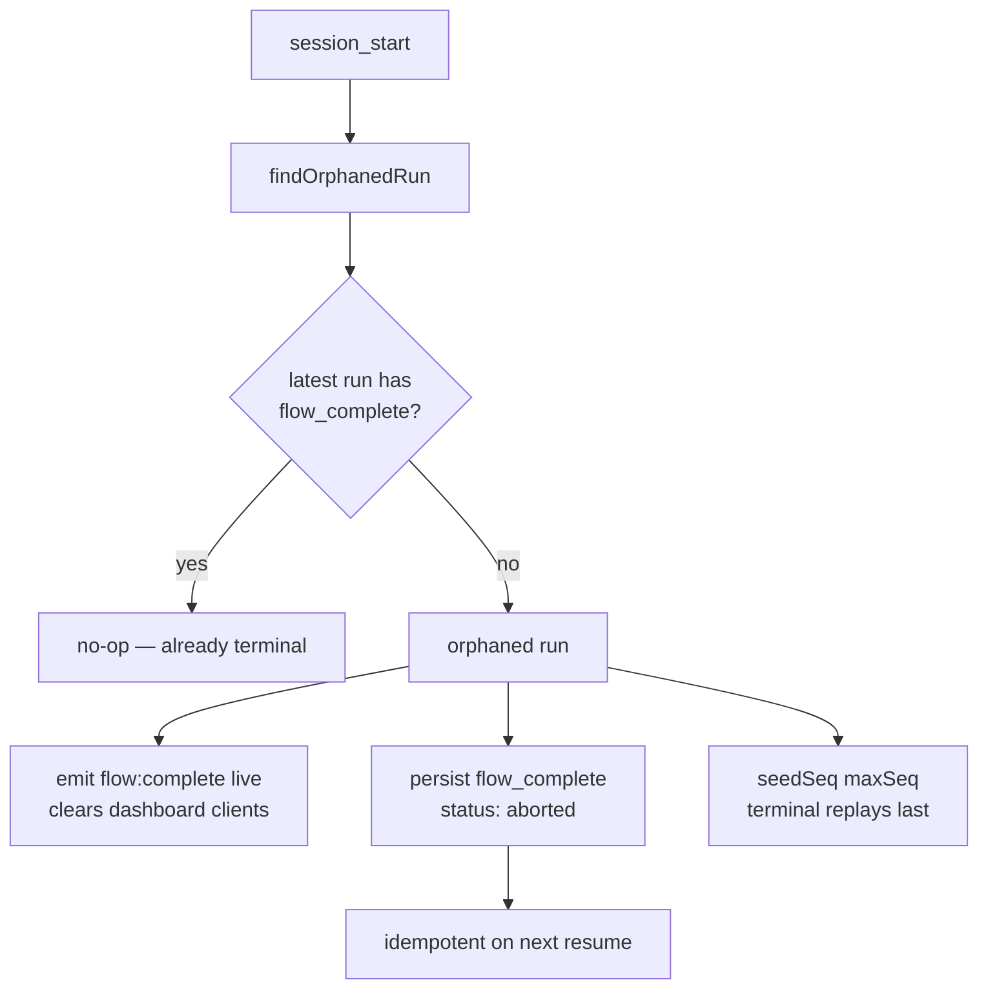

# pi-flows Architecture

> Internal design reference for pi-flows developers and package authors. For user-facing documentation, see [README.md](../README.md).

## System Overview

pi-flows is a multi-agent workflow orchestration engine for [pi](https://github.com/badlogic/pi-mono). It discovers and loads packages at runtime based on `package.json` manifests tagged with the `pi-package` keyword, then provides a DAG-based execution engine for coordinating multiple AI agents.

The engine is organized as a set of cooperating sub-extensions activated through a single entry point (`extensions/index.ts`), ensuring they share one module graph and consistent state.

## Component Stack

```
┌─────────────────────────────────────────────────────────────┐
│                         User (TUI)                          │
│               /flow commands, interactive prompts            │
└────────────────────────────┬────────────────────────────────┘
                             │
┌────────────────────────────▼────────────────────────────────┐
│                      pi-flows Engine                        │
│                                                             │
│  ┌──────────────┐  ┌──────────────┐  ┌──────────────────┐  │
│  │ Flow Executor│  │ Agent Spawner│  │ Agent Dashboard   │  │
│  │              │  │              │  │ (TUI widget)      │  │
│  │ - DAG walk   │  │ - Process    │  │ - Card grid       │  │
│  │ - Branching  │  │   isolation  │  │ - Live metrics    │  │
│  │ - Loops      │  │ - Tool guard │  │ - Status tracking │  │
│  │ - Sub-flows  │  │ - Env inject │  │                   │  │
│  └──────────────┘  └──────────────┘  └──────────────────┘  │
│                                                             │
│  ┌──────────────────────────────────────────────────────┐   │
│  │                   Package Loader                     │   │
│  │  - Discovers pi-package dependencies                 │   │
│  │  - Loads extensions, skills, agents, flows           │   │
│  │  - Resolves namespaced flow commands (pkg:flow)      │   │
│  └──────────────────────────────────────────────────────┘   │
└─────────────────────────────┬───────────────────────────────┘
                              │
         ┌────────────────────┼────────────────────┐
         │                    │                    │
    ┌────▼────┐         ┌────▼────┐         ┌────▼────┐
    │ pkg-a   │         │ pkg-b   │         │ (other) │
    │         │         │         │         │         │
    │ agents/ │         │ agents/ │         │ agents/ │
    │ flows/  │         │ flows/  │         │ flows/  │
    │ skills/ │         │ skills/ │         │ skills/ │
    │ ext/    │         │         │         │ ext/    │
    └─────────┘         └─────────┘         └─────────┘
```

## Package Discovery

The pi-flows engine discovers packages through the npm dependency graph:

1. Scans `node_modules/` for packages with `"pi-package"` in `keywords`
2. Reads the `"pi"` manifest from each package's `package.json`
3. Registers extensions, skills, prompts, and themes from declared paths
4. Agents are loaded from `agents/` directories
5. Flows are loaded from `flows/<namespace>/<name>/flow.yaml` (see [On-Disk Flow Layout](#on-disk-flow-layout))

```json
{
  "name": "my-domain-package",
  "keywords": ["pi-package"],
  "pi": {
    "extensions": ["./extensions/my-ext"],
    "skills": ["./skills"],
    "prompts": ["./prompts"],
    "themes": ["./themes"]
  }
}
```

## On-Disk Flow Layout

Each flow is a **self-contained directory**. The definition file is always named `flow.yaml`, and that flow's code-node handlers (`<id>.ts` plus the generated `<id>.ts.default` scaffold) live in the **same directory**:



Discovery derives the command id `<namespace>:<name>` from the directory structure (`<namespace>/<name>/flow.yaml`), and `FlowConfig.source` is the path to that `flow.yaml`.

**Handler resolution (single source of truth).** Code-node handlers resolve relative to the flow's own directory — `dirname(flow.source)/<id>.ts` — in **both** the executor and the scaffold generator. Because both compute the path the same way from the same `source`, generated and runtime paths are always identical; there is no separate reconstruction step. An explicit `target:` on a code node is the one exception: it still resolves against `cwd`.

Deleting a flow removes the whole flow directory, so handlers travel with their definition and can never be orphaned.

**Breaking change — clean break.** The previous flat layout (`.pi/flows/flows/<namespace>/<name>.yaml`) and the parallel `.pi/flows/handlers/<flow>/` handler tree are **no longer read**; there is no fallback. To migrate, move `<name>.yaml` → `<name>/flow.yaml`, move that flow's handlers into the same directory, and repoint any `flow-ref` paths or globs that referenced `<name>.yaml`.

## Agent Isolation Model

Each agent runs as an in-process isolated session with controlled capabilities:

```
┌──────────────────────────────────────────────────┐
│ Parent Process (pi-flows engine)                 │
│                                                  │
│  spawnAgent(agentDef, task, inputs)              │
│    │                                             │
│    ├── Serialize AGENT_ALLOWED_TOOLS → env       │
│    ├── Inject context files                      │
│    ├── Wire inputs from upstream results         │
│    └── Create agent session                       │
│                                                  │
│  ┌────────────────────────────────────────────┐  │
│  │ Agent Session (isolated)                      │  │
│  │                                            │  │
│  │  ┌─────────┐  ┌──────────┐                │  │
│  │  │ Guard   │  │ Agent    │                │  │
│  │  │         │  │ Prompt   │                │  │
│  │  │ - Tool  │  │ (from    │                │  │
│  │  │   allow │  │  .md)    │                │  │
│  │  │ - File  │  │          │                │  │
│  │  │   access│  │ ${{task}}│                │  │
│  │  │ - Bash  │  │ ${{input │                │  │
│  │  │   deny  │  │    .x}}  │                │  │
│  │  └─────────┘  └──────────┘                │  │
│  │                                            │  │
│  │  → Produces <result> on finish             │  │
│  └────────────────────────────────────────────┘  │
└──────────────────────────────────────────────────┘
```

### Guard Layers

1. **Tool scoping** — `AGENT_ALLOWED_TOOLS` env var parsed into a Set. Only declared tools + `finish` are permitted.
2. **File access** — `access.read` and `access.write` glob patterns control filesystem operations.
3. **Bash deny list** — `access.bash.deny` patterns block specific shell commands.
4. **Agent extensions** — domain packages can register additional extensions (guards, provider middleware, custom tools) into spawned agent sessions via `flow:register-agent-extension`.

## Flow Execution Model

The flow executor walks a DAG of steps, managing parallelism and control flow:

### DAG Segment Execution

```
1. Initialize: completed = {}, running = {}, results = {}
2. Loop:
   a. Find unblocked steps: blockedBy ⊆ completed
   b. Filter by activeSteps (if branch exclusivity applies)
   c. Limit by max_concurrent
   d. Spawn agent processes for unblocked steps
   e. Wait for any completion
   f. Store result, add to completed set
   g. If all steps completed or error → exit loop
```

### Control Flow Primitives

**Fork (user decision):**
```
Fork step → present options to user → user selects → route to branch step(s)
                                                   → skip non-selected branches
```

**Conditional (automatic routing):**
```
Conditional step → check ctx.results[stepId][field]
                → non-empty? → route to "present" target
                → empty?     → route to "absent" target
```

**Agent Loop Decision:**
```
Decision agent → evaluates result → "loop" → jump to loop_target
                                  → "exit" → jump to exit_target
                                  (max_iterations safety limit)
```

**Flow Reference (sub-flow):**
```
flow-ref step → resolve path (supports globs) → execute sub-flow
             → merge sub-flow results into parent context
             → continue to on_complete target
```

### Result Propagation

Results flow through the DAG via interpolation:

```
Step A produces:
  { summary: "...", artifacts: "...", files: [...] }

Step B references:
  task: "Use this: ${{result.step-a.summary}}"
  inputs:
    data: "${{result.step-a.artifacts}}"

Sub-flow results are flat-merged:
  flow-ref runs sub-flow with steps [x, y, z]
  → parent gets: results["x"], results["y"], results["z"]
  → also: results["flow-ref-step-id"] = last agent result
```

## Sub-Extension Activation Order

All sub-extensions are loaded through a single entry point (`extensions/index.ts`) so they share one `jiti` module graph. This eliminates module identity issues where dynamic imports between extensions would create separate module instances. Activation order:

```
1. provider-register  — Model roles (@coding, @planning, etc.) and provider management
2. file-tracker       — Tracks file edits/writes in the main session for footer stats
3. flow-engine        — Discovery, DAG execution, agent spawning, tool registration
4. flow-dashboard     — TUI card grid, navigation, workflow breadcrumbs
5. flow-summary       — Post-flow summary widget with expandable step results
6. flow-context       — #flows: inline reference and flow_results tool for main session
7. flow-footer        — Footer segments: provider, git, file stats, context usage
```

## Extension Lifecycle

Extensions hook into the pi-coding-agent lifecycle:

```
1. Package loaded (npm dependency graph scan for "pi-package" keyword)
2. Extension module imported via jiti
3. default export function called with ExtensionAPI
4. Extension registers:
   - Commands (pi.registerCommand)
   - Event handlers (pi.on / pi.events.on)
   - Tools (pi.registerTool)
   - Flow events (pi.events.emit "flow:register-*")
5. session_start fires:
   - Session auth/model storage captured
   - TUI adapter wired (if ctx.hasUI)
6. Events fire during agent execution:
   - "tool_call" → guard can block
   - flow:subagent-tool-call → observation
   - flow:subagent-tool-result → observation
7. Flow completes:
   - flow:complete → FlowResult emitted
   - Summary widget rendered
8. Cleanup on session end
```

## Flow Lifecycle on Session Close & Resume Reconciliation

A flow runs entirely in-process inside the parent pi session: `FlowManager` holds an in-memory promise plus an `AbortController`, and subagents are in-memory sessions. Closing the parent session destroys all of this mid-run. There is no checkpoint and no graceful-shutdown hook — **flows are not resumable** (executable state is never re-driven).

The only durable trace is the persisted `flow-event` stream. `FlowEventPersister` writes one entry per lifecycle event as `{ seq, eventType, data, flowRunId }`. The terminal `flow_complete` record is written only when the in-process promise settles, so a hard kill leaves a stream with **no terminal record**. Replaying such a stream on resume previously left the flow card hung on "running" forever, and the Abort button was a no-op (its `flow:abort` handler was gated by `if (flowManager.isRunning)`, which is `false` on a resumed session).

### Resume-time reconciliation

On `session_start`, pi-flows scans persisted `flow-event` entries via `findOrphanedRun()`:

1. Group records by `flowRunId`, pick the latest run (highest `seq`).
2. If that run has no `flow_complete` record, it is **orphaned**.
3. For an orphaned run, synthesize a terminal event: emit `flow:complete` live (clearing connected dashboard clients) **and** persist a `flow_complete` record tagged with the orphaned run's `flowRunId` (making the next cold resume idempotent). The synthesized `FlowResult` has `status: "aborted"` and summary `"Flow interrupted — parent session closed"`.
4. Seed the resumed persister's `seq` counter past the orphan's max `seq` via `seedSeq(maxSeq)`, so the synthesized terminal record replays **after** the run's mid-run events (ordering correctness).

The `flow:abort` handler also reconciles when there is no live flow:

```
if (flowManager.isRunning) flowManager.abort();
else reconcileOrphanedFlow("user-abort");   // summary: "Flow aborted (no live run)"
```

Reconciliation is idempotent: once a run has a `flow_complete` record — from clean completion, prior resume reconciliation, or abort reconciliation — it is no longer orphaned.



No dashboard-side code change is required — the synthesized `flow_complete` rides the existing replay/reducer path. Explicit non-goals: no re-driving of executable state, no `SIGTERM` handler.

## FlowManager Architecture

The `FlowManager` class is the central orchestration component. It uses an adapter pattern to decouple execution logic from UI:

```
┌──────────────────────────────────────────────────┐
│ FlowManager                                      │
│                                                  │
│  ┌─────────────────┐  ┌───────────────────────┐  │
│  │ FlowIOAdapter   │  │ FlowObserver[]        │  │
│  │ (pluggable)     │  │ (pluggable)           │  │
│  │                 │  │                       │  │
│  │ - askUser()     │  │ - onFlowStart()       │  │
│  │ - notify()      │  │ - onAgentStarted()    │  │
│  │ - selectFlow()  │  │ - onAgentComplete()   │  │
│  └─────────────────┘  │ - onFlowComplete()    │  │
│                       │ - onToolCall/Result()  │  │
│                       └───────────────────────┘  │
│                                                  │
│  Adapters:              Observers:               │
│  - TuiFlowIOAdapter     - TuiFlowObserver        │
│  - HeadlessFlowIOAdapter- EventEmitObserver       │
└──────────────────────────────────────────────────┘
```

At startup, a `HeadlessFlowIOAdapter` is wired. On `session_start` (if `ctx.hasUI`), it's upgraded to a `TuiFlowIOAdapter` and a `TuiFlowObserver` is added.
