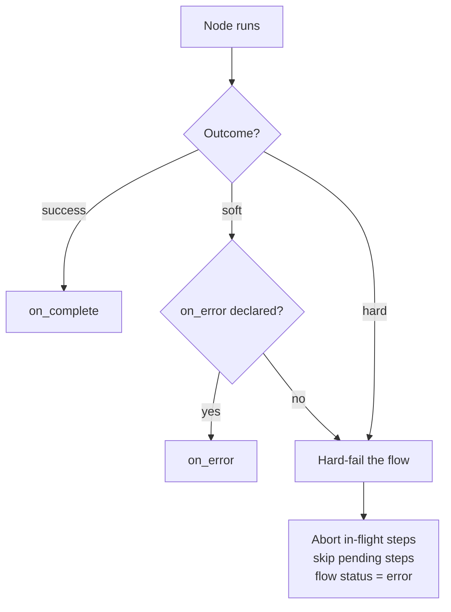
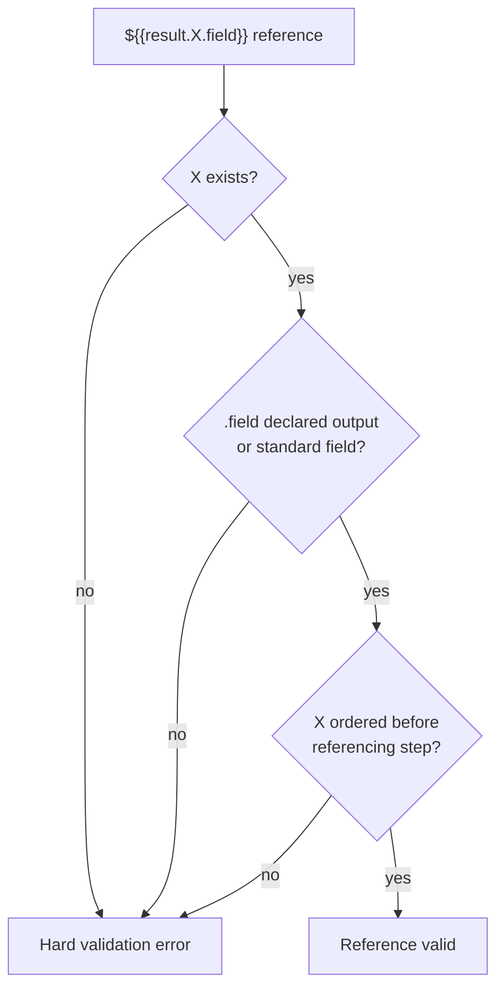

# Flow Reference

Complete reference for authoring flows in pi-flows. Covers all step types with syntax, field references, and practical examples.

---

## Flow File Format

Flows are `.yaml` files with YAML frontmatter followed by step definitions. Each step has a unique `id`, an explicit `type:` (one of `agent`, `agent-decision`, `code`, `code-decision`, `fork`), and is connected to other steps via `blockedBy` declarations to form a directed acyclic graph (DAG). The parser does not infer `type:` — a step missing it is rejected.

**Location:** each flow is a self-contained directory at `.pi/flows/flows/<namespace>/<name>/`, with the definition file always named `flow.yaml` inside it — `.pi/flows/flows/<namespace>/<name>/flow.yaml`. The command id `<namespace>:<name>` is derived from this directory structure. Package-registered flows directories follow the same `<namespace>/<name>/flow.yaml` layout. A flow's code-node handlers are co-located in the same directory (see below).

---

## Flow Frontmatter

```yaml
---
name: research-and-build
description: Research the codebase then implement changes
max_concurrent: 2
task_required: true
task_prompt: "What feature should I research and implement?"
---
```

| Field | Required | Description |
|-------|:--------:|-------------|
| `name` | ✓ | Flow identifier — for documentation; the slash command is derived from the file path |
| `description` | ✓ | What the flow does (shown in command list and dashboard) |
| `max_concurrent` | | Maximum agents running in parallel (default: `4`) |
| `task_required` | | When `true`, prompts the user for a task if none was provided |
| `task_prompt` | | Custom prompt text shown when asking for a task |

> **Command name = file path, not `name:` field.** The slash command is derived from the file path:
>
> | File path | Command |
> |-----------|---------|
> | `.pi/flows/flows/research.yaml` | `/research` |
> | `.pi/flows/flows/my-domain/apply.yaml` | `/my-domain:apply` |

---

## Step Types

Steps form a DAG based on `blockedBy` declarations. pi-flows schedules steps that have no pending dependencies in parallel, respecting `max_concurrent`.

### Agent Step

Dispatches a named agent with a task. This is the most common step type.

**Syntax:**

```yaml
steps:
  - id: my-step
    type: agent
    agent: agent-name
    task: Optional task override with ${{template}} variables
    blockedBy: [step-a, step-b]
    inputs:
      input_name: "${{result.step-a.summary}}"
    on_complete: next-step
    on_error: error-handler
```

**Field reference:**

| Field | Description |
|-------|-------------|
| `id` | **Required.** Unique step identifier |
| `type` | **Required.** Must be `agent`. Every step declares an explicit `type:`. |
| `agent` | **Required.** Agent name to dispatch |
| `task` | Task override (template string). If omitted, uses the flow's task |
| `blockedBy` | Array of step IDs that must complete before this step starts |
| `inputs` | Named inputs wired from template expressions |
| `on_complete` | Step ID to route to on success |
| `on_error` | Step ID to route to on error |

**Example — parallel research with fan-in:**

```yaml
name: multi-research
description: Research multiple domains in parallel

steps:
  - id: backend-research
    type: agent
    agent: researcher
    task: Investigate backend patterns for ${{task}}

  - id: frontend-research
    type: agent
    agent: researcher
    task: Investigate frontend patterns for ${{task}}

  - id: synthesizer
    type: agent
    agent: synthesizer
    blockedBy: [backend-research, frontend-research]
    inputs:
      backend: "${{result.backend-research.summary}}"
      frontend: "${{result.frontend-research.summary}}"
    task: Synthesize findings from both research passes
```

---

### Fork Step

Pause execution and present options to the user. The selected option determines which branch runs.

**Syntax:**

```yaml
  - id: choose-approach
    type: fork
    question: "Which approach do you prefer?"
    options: [Quick fix, Full refactor]
    branches:
      Quick fix: quick-fix-step
      Full refactor: refactor-step
    allowCustom: true
    agent: router-agent
```

**Field reference:**

| Field | Required | Description |
|-------|:--------:|-------------|
| `type` | ✓ | Must be `fork`. |
| `question` | ✓ | Question displayed to the user |
| `options` | ✓ | Comma-separated or YAML list of choices |
| `branches` | ✓ | Map of option text → step ID |
| `allowCustom` | | Appends "Other (describe)" option. Custom freetext routes through the fork's `agent`. Requires `agent`. |
| `multiSelect` | | Allow selecting multiple options. All selected branches run sequentially. |
| `agent` | | Agent for autonomous decisions (alt+a) and custom freetext routing. Required when `allowCustom` is set. |
| `task` | | Task description for the decision agent. Defaults to question + options. |

**Behavior:**

- **Single-select:** Routes to one branch. Unselected branches are skipped (synthetic "skipped" results stored).
- **Multi-select:** Multiple branches run in parallel.
- **After selection:** User is prompted for optional notes (Enter to skip). Fork context is **automatically injected** into the branch step's system prompt.

**Autonomous mode:** When alt+a is active, fork steps with an `agent:` field skip the user prompt and let the agent decide automatically. Forks without `agent:` always prompt the user.

---

### Code Decision Step

Run a TypeScript handler exactly like a [Code Step](#code-step), then route on a reserved `branch` output. Use `code-decision` for deterministic routing — thresholds, presence checks, computed classification — without spawning an agent.

**Syntax:**

```yaml
  - id: route-approval
    type: code-decision
    inputs:
      score: "${{result.reconcile.score}}"
    outputs:
      - name: approvers      # optional data outputs (never `branch`)
    branches:
      auto_approve: export
      needs_human: human-review
      park: hold
```

**Field reference:**

| Field | Required | Description |
|-------|:--------:|-------------|
| `id` | ✓ | Unique step identifier. Also determines the handler filename — must be filesystem-safe. |
| `type` | ✓ | Must be `code-decision`. Like every step, `type:` is required and never inferred. |
| `branches` | ✓ | Map of branch label → target step ID. Must declare **at least 2** branches. |
| `inputs` | | Same as a code step — map of input name → `${{...}}` template string. |
| `outputs` | | Optional data outputs the handler must return. **Never include `branch`** — it is reserved. |
| `target` | | Override the handler file path. When set, no `.ts.default` scaffold is generated. |
| `blockedBy` | | Array of step IDs that must complete before this step runs. |
| `max_iterations` | | Required only when a branch target points to an earlier step (a loop). See [Loops](#loops). |
| `timeout` | | Soft deadline in milliseconds. On expiry the engine aborts `ctx.signal` and the step soft-fails. |

**Handler contract:**

Identical to a [code step](#code-step) — same handler path (`<flow-dir>/<id>.ts`, co-located beside `flow.yaml`, or explicit `target:`), same `inputs`/`outputs`, same soft/hard failure model, same value coercion. The handler ADDITIONALLY returns a reserved `branch: string` key:

```typescript
import type { CodeNodeContext } from "@blackbelt-technology/pi-flows";

interface Input  { score: string }
type Branch = "auto_approve" | "needs_human" | "park";
interface Output { approvers: string }

export default async function (
  input: Input,
  ctx: CodeNodeContext,
): Promise<{ branch: Branch } & Output> {
  const score = Number(input.score);
  if (score >= 0.9) return { branch: "auto_approve", approvers: "alice,bob" };
  if (score >= 0.5) return { branch: "needs_human", approvers: "" };
  return { branch: "park", approvers: "" };
}
```

- **`branch`** — resolved against the step's `branches:` map; the flow routes to the mapped step.
- **`branch` is reserved** — declaring an output named `branch` in `outputs:` is a validation error.
- Data outputs (e.g. `approvers`) follow the normal code-step return contract.

**Validation and failure rules:**

| Condition | Outcome |
|-----------|---------|
| Fewer than 2 `branches` | Validation error — use a plain `code` step with `on_complete` instead. |
| `branch` declared in `outputs:` | Validation error — `branch` is reserved. |
| Handler return omits `branch` | Soft failure naming the reserved `branch` output. |
| Returned `branch` not in `branches:` | **Hard** failure — halts the flow (consistent with `agent-decision`). |
| Any code-step failure (throw, contract violation, timeout) | Soft failure — routes to `on_error`, or hard-fails when none. |

**Type-safe scaffold:** `/flows:generate` emits a `type Branch = "auto_approve" | "needs_human" | "park";` union for each `code-decision` and types the handler return as `Promise<{ branch: Branch } & Output>`, so an off-map label is a compile-time error. Scaffolds write a `.ts.default` and never overwrite an implemented handler.

> **Migrating from `conditional`.** The removed `conditional` step is replaced by `code-decision`. Read the value previously in `check: <stepId>.<key>` as a handler **input** and return `{ branch: "present" }` or `{ branch: "absent" }`, with `branches: { present: <present-target>, absent: <absent-target> }`. Standard fields (`artifacts`, `summary`, `files`, `status`) remain available as `${{result.<stepId>.<field>}}` inputs.

---

### Agent Decision Step

Delegate a routing decision to an agent. The agent analyzes the context and calls `finish` with a `branch` name.

**Syntax:**

```yaml
  - id: route-decision
    type: agent-decision
    agent: router-agent
    task: "Review and decide: ${{result.analyzer.summary}}"
    branches:
      needs-work: fix-step
      ready: deploy-step
```

**Field reference:**

| Field | Required | Description |
|-------|:--------:|-------------|
| `type` | ✓ | Must be `agent-decision`. |
| `agent` | ✓ | Agent name — must call `finish` with a valid `branch` |
| `task` | ✓ | Task for the decision agent. Supports template variables. |
| `branches` | ✓ | Map of branch names → step IDs |
| `max_iterations` | | Required only when a branch target points to an earlier step (a loop). See [Loops](#loops). |

**Agent finish call:**

```
finish(summary="Quality is sufficient.", branch="ready")
```

If the agent returns a `branch` not in `branches`, the flow hard-fails. An `agent-decision` may loop by pointing a branch at an earlier step — see [Loops](#loops).

---

### Loops

A **loop** is any `*-decision` node — `agent-decision` or `code-decision` — whose branch target points to an **earlier** step, re-entering the graph to form a cycle. There is no dedicated loop step type; a loop is just a backward branch edge.

**Rules:**

- A `*-decision` node with a branch target pointing to an earlier step **MUST** declare `max_iterations`.
- The engine tracks per-node iteration counts and forces exit when the cap is reached — control falls through to the next step.
- A `*-decision` node whose branches all point forward needs no `max_iterations`.
- The dashboard ↻ iteration badge is driven by the `flow:loop-iteration` event, emitted only when a backward edge is actually taken — not inferred from the presence of `max_iterations`.

**Agent-driven verify/fix loop:**

```yaml
steps:
  - id: developer
    type: agent
    agent: developer
    task: Implement ${{task}}

  - id: verify-loop
    type: agent-decision
    agent: verifier
    task: >
      Check implementation (attempt ${{loop.verify-loop.iteration}}/${{loop.verify-loop.max}}).
      Developer output: ${{result.developer.summary}}
    branches:
      rework: developer      # backward edge → loop
      done: finalize         # forward edge → exit
    max_iterations: 3

  - id: finalize
    type: agent
    agent: summarizer
    task: Summarize the completed implementation
```

The agent calls `finish(branch="rework")` to loop back to `developer`, or `finish(branch="done")` to exit. The label resolves against `branches:`. A `code-decision` loops the same way — return `{ branch: "rework" }` from the handler.

> **Migrating from `agent-loop-decision`.** The removed `agent-loop-decision` step is replaced by `agent-decision` with a backward branch. Move `loop_target` and `exit_target` into `branches:` (e.g. `branches: { rework: <loop_target>, done: <exit_target> }`) and keep `max_iterations`. The agent calls `finish(branch="rework")` or `finish(branch="done")`.

---

### Routing Node Semantics

A routing node (`fork`, `agent-decision`, `code-decision`) **always executes**, so its own outputs are always populated. For a loop, a node's outputs reflect the **last** iteration. Forward branches that are not taken receive synthetic `skipped` results; an unresolved `${{result.<id>.<field>}}` expands to the empty string — never `undefined`.

---

### Code Step

Execute a TypeScript handler function in-process. Code steps run deterministic, tool-free logic — validation, transformation, computation — without spawning an agent.

**Syntax:**

```yaml
  - id: validate-nav
    type: code
    inputs:
      invoice: "${{result.extract.canonical}}"
    outputs:
      - name: valid
      - name: nav_record
    blockedBy: [extract]
    on_complete: approve
    on_error: park
```

**Field reference:**

| Field | Required | Description |
|-------|:--------:|-------------|
| `id` | ✓ | Unique step identifier. Also determines the handler filename — must be filesystem-safe. |
| `type` | ✓ | Must be `code`. Like every step, `type:` is required and never inferred. |
| `inputs` | | Map of input name → `${{...}}` template string. Each resolved value arrives in the handler as a string. Unresolved templates become `""`. |
| `outputs` | | List of `{ name }` objects declaring which keys the handler must return. Names must be valid JS identifiers and unique within the step. |
| `target` | | Override the handler file path. When set, the step imports that file directly and no `.ts.default` scaffold is generated. |
| `blockedBy` | | Array of step IDs that must complete before this step runs. |
| `on_complete` | | Step ID to route to on success. |
| `on_error` | | Step ID to route to on recoverable failure. |
| `timeout` | | Soft deadline in milliseconds. On expiry the engine aborts `ctx.signal` and the step soft-fails. |

**Handler contract:**

The handler is the module's **default export** — an `async` function `(input, ctx) => output`.

```typescript
import type { CodeNodeContext } from "@blackbelt-technology/pi-flows";

interface Input  { invoice: string }
interface Output { valid: string; nav_record: string }

export default async function (input: Input, ctx: CodeNodeContext): Promise<Output> {
  ctx.logger("validating invoice...");
  return { valid: "true", nav_record: "..." };
}
```

- **`input`** — every declared input, template-expanded to a string, keyed by name.
- **`ctx`** — a `CodeNodeContext` with `signal`, `cwd`, `logger`, `setSummary`, `flowName`, `stepId`, and `task`. See [public-api.md → CodeNodeContext](./public-api.md#codenodecontext).
- **Return** — an object containing **exactly** the declared `outputs`. Every declared key must be present; no undeclared extras. A step with no `outputs` must return `{}`.

**Value coercion:**

| Return value type | Behaviour |
|-------------------|-----------|
| `string` | Passes through unchanged |
| `number`, `boolean`, `bigint` | Converted via `String()` |
| `object`, `array`, `null` | Soft failure naming the offending key — call `JSON.stringify()` intentionally if you need serialised data |

**Handler location and generation:**

The real handler is co-located with the flow definition at `<flow-dir>/<id>.ts`, where `<flow-dir>` is `dirname(flow.source)` — the same directory that holds `flow.yaml`. A scaffold template is written alongside it as `<flow-dir>/<id>.ts.default` on every successful flow save and via the `/flows:generate <name>` command. The generator and the executor resolve this path identically (source-relative), so generated and runtime paths never diverge. The `.default` suffix makes the file un-importable by the engine; copy it, drop `.default`, then implement the body. The template is always regenerated from the YAML; it never touches the real `.ts`.

When a `target:` field is set the step imports that path directly and no template is generated.

**Failure modes for code steps:**

| Condition | Outcome |
|-----------|---------|
| Plain `throw` / contract violation / coercion error / missing handler / timeout | Soft failure — routes to `on_error`, or hard-fails the flow when `on_error` is absent |
| `throw new FlowHardError(msg)` | Unconditional hard failure — stops the flow immediately regardless of `on_error` |

See [Failure Modes](#failure-modes) and [public-api.md → FlowHardError](./public-api.md#flowharderror).

---

## Failure Modes

Every node in a flow resolves to exactly **one** of three outcomes. The outcome decides where the flow goes next.

| Outcome | Meaning | Routing |
|---------|---------|---------|
| `success` | The node completed its work | Routes to the node's `on_complete` |
| `soft` | A recoverable failure — the node ran but reported a logical problem | Routes to the node's `on_error` |
| `hard` | An unrecoverable failure | Aborts in-flight parallel steps, skips all pending steps, and ends the flow with status `error`, surfacing the failure message |



### `on_error` is the soft switch

A soft-eligible failure routes to `on_error` **when the node declares one**. A soft-eligible failure on a node with **no `on_error` hard-fails the flow**. This is fail-fast by default: if you do not handle a recoverable failure, the flow stops rather than silently continuing.

> **⚠️ Breaking behavioral change.** Previously, a failure on a node with no `on_error` silently continued. It now **hard-fails the flow**. Flows that relied on silent continuation must add an explicit `on_error` target to the affected node.

### How agent failures are classified

Agent outcomes are determined **structurally** — there is no error-message parsing and no deliberate "fatal" signal from the agent.

| Agent end state | Outcome |
|-----------------|---------|
| `finish(status:"complete")` | `success` |
| `finish(status:"error")` or `finish(status:"blocked")` | `soft` (the agent ran and reported a logical failure) |
| Terminated with a terminal API error and no `finish` (pi-coding-agent's auto-retries exhausted: rate limit, quota, auth) | `hard` (the provider is unusable for the rest of the flow) |
| Terminated without finishing and without an API error | `soft` |

**Capped no-finish reminder.** If an agent stops without calling `finish` (and there is no API error), it receives at most **2** reminders that include the `finish` tool-call format. If it still does not finish, the node resolves as a clean `soft` failure — never `status:"unknown"`, and never an infinite loop.

### Transient retries are delegated to pi

pi-coding-agent already auto-retries transient errors (rate limit, 5xx, overloaded, network, timeout) with exponential backoff. pi-flows adds **no** redundant retry layer. By the time an error reaches the flow engine, it is terminal.

### Code and extension nodes

For nodes implemented in code (extensions), the thrown error decides the outcome:

| Thrown | Outcome |
|--------|---------|
| A plain `throw` (any `Error`) | `soft` failure — routes to `on_error` if declared, otherwise hard-fails |
| `throw new FlowHardError(msg)` | **Unconditional** `hard` failure — stops the flow regardless of `on_error` |

`FlowHardError` is exported from the package. See [public-api.md](./public-api.md) for its shape and usage.

---

## Template Variable Reference

Template variables are placeholders in `task`, `inputs`, and `question` fields. They are expanded just before an agent is dispatched.

| Variable | Resolves To |
|----------|-------------|
| `${{task}}` | The task passed when the flow was invoked |
| `${{input.NAME}}` | A wired input value (from the `inputs:` block) |
| `${{result.STEP-ID}}` | Full raw output from a completed step |
| `${{result.STEP-ID.summary}}` | Summary from `finish(summary:)` |
| `${{result.STEP-ID.status}}` | Status: `complete`, `error`, or `blocked` |
| `${{result.STEP-ID.artifacts}}` | The `<artifacts>` XML block from `finish` |
| `${{result.STEP-ID.files}}` | Comma-separated file paths created/modified |
| `${{result.STEP-ID.<outputName>}}` | A typed output from the agent's `outputs:` declaration |
| `${{loop.STEP-ID.iteration}}` | Current iteration (1-based) in a loop step |
| `${{loop.STEP-ID.max}}` | Maximum iterations configured for a loop |

> **Resolution order:** Variables are expanded at dispatch time. `${{result.X}}` is only valid if step `X` has already completed (guaranteed when `X` is in `blockedBy`).

> **Missing values resolve to empty string at runtime.** A reference that survives validation but has no value at dispatch (e.g. an undeclared input) expands to `""`. Reference _correctness_, however, is checked ahead of time — see below.

---

## Reference Validation

`validateFlowContent` checks every `${{result.X}}` and `${{result.X.field}}` reference at flow-load time. Invalid references are **hard validation errors** — the flow will not run until they are fixed. This catches typos and broken wiring before any agent is dispatched, rather than silently expanding to `""`.

Three rules are enforced:

**1. The referenced step must exist.** `${{result.foo}}` where no step has `id: foo` is an error.

**2. The `.field` must be resolvable.** For agent and code steps, a `.field` must be either a declared output (the agent's `outputs:` or the code step's `outputs:`) **or** one of the standard fields that always resolve:

| Standard field | Always resolves |
|----------------|-----------------|
| `summary` | ✓ |
| `status` | ✓ |
| `artifacts` | ✓ |
| `files` | ✓ |
| `fullOutput` | ✓ |

A `.field` that is neither a declared output nor a standard field is an error.

**3. The referenced step must be ordered before the referencing step.** `${{result.X}}` is only valid if `X` is **guaranteed to complete first**. That guarantee holds when `X` is a transitive `blockedBy` ancestor of the referencing step, **or** when `X` routes into the referencing step through an `on_complete` / `on_error` / branch / loop edge chain. If neither path exists, it is an error.

> **The engine does not auto-add the dependency.** When ordering fails, you must add `blockedBy: [X]` (or a routing edge) yourself. pi-flows reports the missing ordering as an error; it never silently wires it for you.



### Loop iteration is 1-based

`${{loop.STEP.iteration}}` is **1-based** and consistent across the loop. The first body pass observes `iteration == 1` (not `0`), and the loop-decision step sees the same value on that pass: when the body runs pass _N_, both the body and the decision step observe `${{loop.STEP.iteration}} == N`.

---

## Input Wiring

Inputs wire specific data from one step to another as named variables, separate from the task text.

### Declare on the agent

```yaml
# agents/developer.md
inputs:
  - research_output
  - ticket_context
```

### Wire in the flow step

```yaml
  - id: developer
    agent: developer
    blockedBy: [researcher]
    inputs:
      research_output: "${{result.researcher.summary}}"
      ticket_context: "${{result.ticket-fetch.artifacts}}"
```

### Reference in the system prompt

```markdown
Research context:
${{input.research_output}}

Ticket context:
${{input.ticket_context}}
```

If `inputs:` is not declared in the agent's frontmatter, the input values are substituted but the system prompt has no `${{input.NAME}}` to expand them into.

### File Content Injection (`file://` prefix)

When an agent needs the **content** of a file (not just a path), use the `file://` prefix:

```yaml
  - id: validate
    agent: validator
    blockedBy: [researcher]
    inputs:
      report: file://research/findings.md
```

**Dynamic path from previous step:**

```yaml
  - id: summarize
    agent: summarizer
    blockedBy: [writer]
    inputs:
      report: file://${{result.writer.files}}
```

**Rules:**
- The producing step **MUST** be in `blockedBy` so the file exists at dispatch time
- File content is injected **verbatim** (never template-expanded)
- If the file doesn't exist, the step fails with a clear error

---

## Common Flow Patterns

### Research → Plan → Execute

```yaml
name: research-and-build
description: Research, plan, then implement

steps:
  - id: research
    type: agent
    agent: researcher
    task: Investigate the codebase for ${{task}}

  - id: planner
    type: agent
    agent: planner
    blockedBy: [research]
    task: Create an implementation plan based on: ${{result.research.summary}}

  - id: implementer
    type: agent
    agent: developer
    blockedBy: [planner]
    inputs:
      plan: "${{result.planner.summary}}"
    task: Implement the plan. Details: ${{input.plan}}
```

### Interactive Branching

```yaml
name: flexible-workflow
description: User-driven workflow selection

steps:
  - id: choose
    type: fork
    question: "How thorough should the analysis be?"
    options: [Quick scan, Deep analysis]
    branches:
      Quick scan: quick
      Deep analysis: deep

  - id: quick
    type: agent
    agent: quick-scanner
    task: Quick scan of ${{task}}

  - id: deep
    type: agent
    agent: deep-analyzer
    task: Deep analysis of ${{task}}

  - id: report
    type: agent
    agent: reporter
    blockedBy: [quick, deep]
    task: Generate report from analysis results
```

### Verify-Fix Loop

```yaml
name: implement-and-verify
description: Implement with verification loop

steps:
  - id: implement
    type: agent
    agent: developer
    task: Implement ${{task}}

  - id: verify
    type: agent
    agent: verifier
    blockedBy: [implement]
    task: Verify the implementation

  - id: verify-loop
    type: agent-decision
    agent: flow-decision
    task: "Evaluate: ${{result.verify.summary}}"
    branches:
      rework: implement     # backward edge → loop
      done: done            # forward edge → exit
    max_iterations: 3

  - id: done
    type: agent
    agent: summarizer
    task: Summarize the completed work
```
