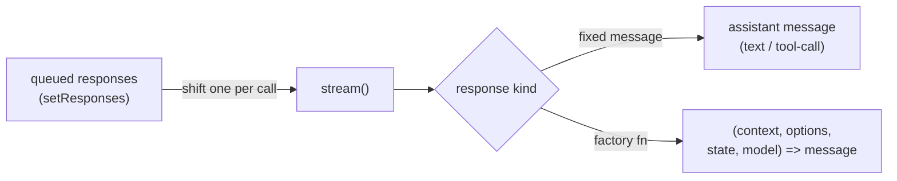

# Testing pi-flows with the Faux Model

> Contributor reference for the faux-model flow test infrastructure. The harness lives at [`__tests__/faux-harness.ts`](../__tests__/faux-harness.ts); the capability contract is [`openspec/specs/faux-model-testing/spec.md`](../openspec/specs/faux-model-testing/spec.md). For the execution model these tests exercise, see [architecture.md](./architecture.md).

## Purpose

The faux-model tests drive the **real** `spawnAgent` / `runFlow` code paths against a scripted, zero-network "faux" provider from `@earendil-works/pi-ai`. There is no LLM, no credentials, and no network — every provider response is something the test queued up front, so runs are fully deterministic.

This means the tests catch **engine and orchestration behaviour**:

- the tool guard (authorized vs. unauthorized tool dispatch),
- the finish latch and first-correct-wins semantics,
- the stop-gate retry bound,
- abort wiring (abort mid-stream),
- failure routing (soft `node-failure-model` on `status: "error"`, hard on exhausted provider errors),
- multi-step output wiring (`${{result.<step>.<out>}}`),
- parallel fan-in scheduling, code / code-decision routing, branch exclusivity,
- and agent-decision loops (backward edges + `max_iterations`).

They do **not** catch anything about real model judgment or prompt quality. The faux provider returns exactly what you script — it never reasons, never echoes, and never validates that a prompt is good. If you need to know whether a prompt produces sensible output, that is out of scope for these tests.

## The Faux Provider Model



You queue an ordered list of responses. **Each `stream()` call shifts exactly one** off the front. A queued response is either:

1. a **fixed assistant message** (text, thinking, or tool-call blocks), or
2. a **factory function** `(context, options, state, model) => message` that computes its response from the live call context.

There is **no built-in echo** — if a test wants to observe a value flowing through the system, it must script a response that explicitly includes that value (see the wiring example below).

## Harness API

All faux-provider knowledge is confined to `faux-harness.ts`. Suites speak only in the harness verbs below.

### Scripting verbs

| Verb | Signature | Produces |
|---|---|---|
| `scriptFinish` | `(args: FinishArgs, finishToolName = "finish")` | a single schema-valid `finish` tool call |
| `scriptToolThenFinish` | `(toolName, toolArgs, finishArgs: FinishArgs, finishToolName = "finish")` | a two-turn sequence: tool call, then finish |
| `scriptError` | `(message: string)` | a provider-level error response (`stopReason: "error"`) — drives soft-fail routing |
| `scriptSlowText` | `(text: string)` | a long text block that streams slowly (for abort-mid-stream tests) |

### Helpers

| Helper | Signature | Purpose |
|---|---|---|
| `makeAgent` | `(partial: Partial<AgentConfig> = {})` | minimal `AgentConfig` with sensible defaults; override via `partial` |
| `makeFauxRegistry` | `(faux)` | a `modelRegistry` stub backed by the faux models, plus a no-op `authStorage` |
| `lastUserText` | `(context)` | the text of the last user message in a faux stream context (used inside responders) |

### `FinishArgs`

```ts
interface FinishArgs {
  status: "complete" | "error" | "blocked";
  summary: string;
  branch?: string;            // decision branch — only under decisionBranches
  [key: string]: unknown;     // declared typed outputs (any JSON type)
}
```

For the happy path, the finish must be **schema-valid** — `status` and `summary` are required. Omitting them simulates a malformed finish that the guard rejects (used in the retry/latch test). Extra keys map to the agent's declared typed outputs.

### `spawnFaux` — single-agent loop

```ts
spawnFaux(options: SpawnFauxOptions): Promise<{ result; faux; finishToolName }>
```

Runs the real `spawnAgent` loop against a scripted faux provider, registering the faux api for the duration of the call and unregistering it afterwards (no leaked provider state).

`SpawnFauxOptions`:

| Field | Type | Notes |
|---|---|---|
| `agent` | `Partial<AgentConfig>` | merged over `makeAgent` defaults |
| `task` | `string` | defaults to `"do the thing"` |
| `responses` | `FauxResponseStep[]` | **required** — the queued responses |
| `signal` | `AbortSignal` | for abort-mid-stream tests |
| `modelApi` | `string` | faux model `api`; set `"anthropic-messages"` to exercise the `mcp__flows__` prefix path |
| `modelId` | `string` | default `"faux-1"` |
| `tokensPerSecond` | `number` | streaming rate; low values make abort deterministic |
| `cwd` | `string` | defaults to `process.cwd()` |

The returned `finishToolName` tells the test which tool name the agent finishes with (prefixed under `anthropic-messages`).

### `runFaux` — multi-agent DAG

```ts
runFaux(options: RunFauxOptions): Promise<FlowResult>
```

Runs the real `runFlow` DAG executor. One faux api/model backs every agent; a **responder** selects each turn's response by inspecting the dispatched task (never queue order).

`RunFauxOptions`: `flow`, `agents`, `responder: (taskText, model) => FauxResponseStep`, `cwd?`, `maxTurns?` (default 24, covers retries), `signal?`.

### `runFauxFlow` — full integration

```ts
runFauxFlow(options: RunFauxFlowOptions): Promise<FlowResult>
```

Extends `runFaux` for large DAGs that mix agents with code nodes, forks, and loops. Adds:

| Field | Type | Notes |
|---|---|---|
| `codeHandlers` | `Record<stepId, string>` | source for `code` / `code-decision` steps; each is written to a temp `.mjs` file and wired into the step's `target:`. Source must `export default async function handler(input, ctx)` |
| `forkAnswers` | `Record<forkStepId, string>` | answers for interactive `fork` steps |
| `onAgentStarted` / `onAgentComplete` | callbacks | observe step lifecycle (e.g. tally loop re-entries) |
| `responder`, `maxTurns` | inherited | `maxTurns` default here is 48 |

## The Responder Pattern

For multi-agent flows, you do not queue responses one-per-step. Instead you supply a **responder** that selects a response by a **stable discriminator** — the dispatched task text (`lastUserText(context)`) or the resolving model id — never by queue order. The harness queues `maxTurns` copies of a factory that delegates to your responder, so order is irrelevant and concurrent/looping steps stay deterministic.

```ts
responder: (taskText, model) => {
  if (/INTAKE/.test(taskText))  return scriptFinish({ status: "complete", summary: "intake", topic: "WIDGETS" });
  if (/RESEARCH/.test(taskText)) return scriptFinish({ status: "complete", summary: "researched" });
  return scriptFinish({ status: "complete", summary: "default" });
}
```

Routing on content (not call count) is what makes parallel fan-in and loop re-entry tests robust.

## Two Gotchas

**1. The faux provider must be registered into pi-coding-agent's *nested* pi-ai.**
`@earendil-works/pi-coding-agent` bundles its own nested copy of `@earendil-works/pi-ai`, and the api-provider registry is module-scoped. The harness resolves that exact nested `pi-ai/compat.js` via a filesystem walk-up and registers the faux provider there — the same instance `createAgentSession` resolves streams through. A contributor who imports `pi-ai` directly hits a *different* registry and every session fails with **"No API provider registered"**. Always go through the harness.

**2. The model's `api` drives the finish tool-name prefix.**
With the default `api: "faux"`, the finish tool is `finish`. With `api: "anthropic-messages"`, it becomes `mcp__flows__finish`. Pass `modelApi: "anthropic-messages"` to `spawnFaux` to exercise the prefixed path; the returned `finishToolName` reflects the active form.

## Worked Examples

### (a) A single `spawnFaux` finish test

```ts
import { describe, it, expect } from "vitest";
import { spawnFaux, scriptFinish } from "./faux-harness.js";

describe("faux spawnAgent — finish happy path", () => {
  it("a schema-valid finish yields success with wired output", async () => {
    const { result } = await spawnFaux({
      responses: [
        scriptFinish({
          status: "complete",
          summary: "did the thing",
        }),
      ],
    });

    expect(result.success).toBe(true);
    expect(result.result.status).toBe("complete");
    expect(result.finishParams?.summary).toBe("did the thing");
  });
});
```

### (b) A `runFaux` multi-step wiring test

```ts
import { describe, it, expect } from "vitest";
import { runFaux, makeAgent, scriptFinish } from "./faux-harness.js";
import type { FlowConfig } from "../extensions/flow-engine/types.js";

describe("faux runFlow — multi-step output wiring", () => {
  it("a downstream step receives an upstream agent's declared output", async () => {
    const flow: FlowConfig = {
      name: "wiring",
      description: "two-step wiring",
      source: "<faux>",
      steps: [
        { stepType: "agent", id: "producer", agent: "producer", task: "produce a widget id" },
        { stepType: "agent", id: "consumer", agent: "consumer",
          task: "consume ${{result.producer.out}}", blockedBy: ["producer"] },
      ],
    };

    const agents = [
      makeAgent({ name: "producer", model: "faux/faux-1", outputs: [{ name: "out" }] }),
      makeAgent({ name: "consumer", model: "faux/faux-1" }),
    ];

    const result = await runFaux({
      flow,
      agents,
      responder: (taskText) =>
        /produce/.test(taskText)
          ? scriptFinish({ status: "complete", summary: "produced", out: "WIDGET-42" })
          : scriptFinish({ status: "complete", summary: `received: ${taskText}` }),
    });

    expect(result.results.producer.outputs.out).toBe("WIDGET-42");
    expect(result.results.consumer.summary).toContain("WIDGET-42");
  });
});
```

The full-integration pattern (fan-in, code nodes, code-decision routing, and a verify loop) lives in [`__tests__/faux-flow-integration.test.ts`](../__tests__/faux-flow-integration.test.ts).

## Robust Loop Assertions

The `${{loop.<id>.iteration}}` counter timing is an **engine-internal detail**. Assert *invariants*, not exact counts:

- **re-entry happened** — e.g. the looped step ran ≥ 2 times,
- **termination within the cap** — the run count is bounded by `max_iterations`,
- **the exit branch was reached** — the forward target completed.

Pinning an exact iteration count couples the test to engine internals and makes it brittle.

## How to Run

```sh
npm test                                   # full Vitest suite
npx vitest run __tests__/faux-*.test.ts    # just the faux-model tests
```

## Using the harness from a downstream package

The harness is **shipped** — it is part of the published package and importable as
`@blackbelt-technology/pi-flows/testing`. Downstream consumers do not need deep imports
and do not need to live inside the pi-flows repo.

The harness body lives in [`extensions/flow-engine/testing.ts`](../extensions/flow-engine/testing.ts);
the in-repo [`__tests__/faux-harness.ts`](../__tests__/faux-harness.ts) is now a thin re-export of it.
So in-repo suites keep importing from `./faux-harness.js`, while downstream consumers import from
`@blackbelt-technology/pi-flows/testing`. The public surface intentionally re-exports the faux
runners (`runFauxFlow`, `spawnFaux`, `runFaux`), the scripting verbs (`scriptFinish`,
`scriptToolThenFinish`, `scriptError`, `scriptSlowText`), and the helpers (`makeAgent`,
`lastUserText`, `parseFlowYamlString`) — it does **not** export the engine entrypoints
`runFlow` / `spawnAgent`, which the faux runners wrap.

```ts
import { describe, it, expect } from "vitest";
import {
  spawnFaux,
  scriptFinish,
  parseFlowYamlString,
  runFaux,
} from "@blackbelt-technology/pi-flows/testing";

describe("my flow — finish happy path", () => {
  it("a schema-valid finish yields success", async () => {
    const { result } = await spawnFaux({
      responses: [scriptFinish({ status: "complete", summary: "did the thing" })],
    });

    expect(result.success).toBe(true);
    expect(result.result.status).toBe("complete");
  });

  it("a two-step flow wires an upstream agent's declared output", async () => {
    // YAML steps use `type:` (e.g. `type: agent`), not the internal `stepType:`.
    const flow = parseFlowYamlString(
      `name: wiring
description: two-step wiring
steps:
  - type: agent
    id: producer
    agent: producer
    task: produce a widget id
  - type: agent
    id: consumer
    agent: consumer
    blockedBy: [producer]
    task: consume \${{result.producer.out}}
`,
      "<downstream>",
    );

    const result = await runFaux({
      flow,
      agents: [
        { name: "producer", model: "faux/faux-1", outputs: [{ name: "out" }] },
        { name: "consumer", model: "faux/faux-1" },
      ],
      responder: (taskText) =>
        /produce/.test(taskText)
          ? scriptFinish({ status: "complete", summary: "produced", out: "WIDGET-42" })
          : scriptFinish({ status: "complete", summary: `received: ${taskText}` }),
    });

    // Typed agent outputs live under `.outputs`.
    expect(result.results.producer.outputs.out).toBe("WIDGET-42");
    expect(result.results.consumer.summary).toContain("WIDGET-42");
  });
});
```

**TypeScript-loader constraint.** The subpath entry is a `.ts` file, so the consumer must run
tests under a TypeScript-aware runner (vitest works). This is the same constraint as the root
`@blackbelt-technology/pi-flows` export — the `.ts` entry needs a TS-aware loader.

**Install-layout support.** This works under both npm (version-pinned nested layout) and pnpm
(symlink layout) because the harness anchors faux-provider registration to pi-coding-agent's real
install location — it follows the dependency edge rather than walking up directories.
