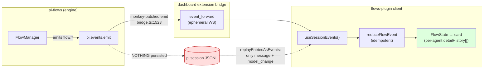
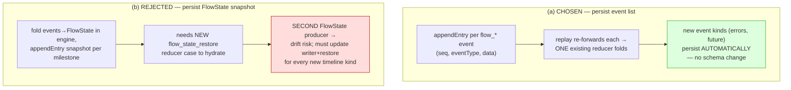
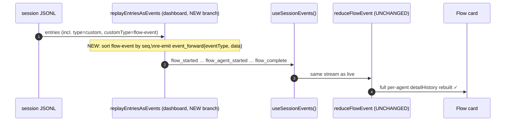

## Context

pi-flows emits ~27 `flow:*` / `flow:architect-*` lifecycle events from the engine. The dashboard integration today is **live-only**:



Verified facts that constrain this design (from investigation of `pi-agent-dashboard@0.5.4`):

- **Flows are strictly session-scoped.** `sessionId` is the canonical key everywhere: server `stateStore = Map<sessionId, FlowsSessionServerState>`, client `useSessionEvents(sessionId)` / `useFlowsSessionState(sessionId)`, and an availability `Map<sessionId, boolean>`. The bridge tags every `event_forward` with `sessionId` (`bridge.ts:697`). There are **two distinct per-session channels**: the **event stream** (`session-events-store`, keyed by sessionId) carries flow *run* state; the **session-data keys** `flowsList`/`commandsList` (`publishSessionData(sessionId, …)` + `subscribeSessionDataKey`) carry flow *availability* (`shouldRenderFlowsSubcard`). Flow run state lives in the event-stream channel.
- **`sessionId` is stable across a reload but not a session change.** The bridge reuses `prev.sessionId` on reload (`bridge.ts:231`), so a reconnect re-feeds the *same* session's event store via replay. A session change (new/fork/resume-as-new) mints a fresh sessionId, unregisters the old, and resends `flows_list` — a clean slate, no prior flow.
- **Client is already replay-shaped.** `useFlowsSessionState` calls `useSessionEvents(sessionId)` and folds the stream with idempotent `reduceFlowEvent` / `reduceArchitectEvent`. Replaying the same events rebuilds the identical card — no client change needed to consume a replay.
- **Per-agent timeline is full-fidelity, in order.** `FlowAgentState.detailHistory: FlowDetailEntry[]` interleaves `{kind:"text"}`, `{kind:"thinking"}`, `{kind:"tool", input, output, isError}` — fed by `flow_assistant_text`, `flow_thinking_text`, `flow_tool_call`, `flow_tool_result`. Structurally equal to the subagent gold standard `AgentDetails.entries[]`.
- **`FlowDetailEntry` defines `{kind:"error"}` but nothing emits it.** No `flow:agent-error` event, no `onError` observer hook, no reducer case. Message-level errors only set `flow_agent_complete.status="error"`.
- **Replay skips custom entries.** `replayEntriesAsEvents` (packages/shared/src/state-replay.ts) only branches on `entry.type === "message"` and `"model_change"`. It already forwards `msg.details` for `toolResult` messages (that is exactly how subagent `AgentDetails` survives) — but `custom`/`custom_message` entries are silently dropped.
- **Server `stateStore` is not a reload safety net — and not even wired.** `ServerPluginContext` DOES expose a push hook `onEvent(sessionId, event)` plus `eventStore.getEvents(sessionId)`, but the flows-plugin's `stateStore.applyEvent` is currently called by nothing; the server only powers the action-bar intent. Even if wired, server-held state is RAM-only (lost on server restart, absent on a fresh pi `/resume`), so it is a live-reconnect rebroadcast nicety, NOT durable reload. Flow cards render purely from the client-side fold of the event stream.

Constraint from the repo's architecture docs: pi-flows owns the engine + events; the dashboard owns the React reaction and the replay/intent contract. Cross-repo dashboard work is delegated via a brief, not co-located (precedent: `archive/2026-05-11-align-with-dashboard-plugins`).

## Goals / Non-Goals

**Goals:**
- A completed (and in-progress) flow run survives `/resume`, browser refresh, and dashboard server restart, rebuilding the full per-agent timeline (assistant text, reasoning/thinking, tool calls + results, errors).
- Persistence lives in pi-flows and is dashboard-agnostic (works in pure TUI sessions too — the data is in the session JSONL regardless of who reads it).
- Zero new dashboard reducer cases for the existing timeline kinds; replay reuses the live fold.
- Close the pre-existing error-timeline fidelity gap.

**Non-Goals:**
- **Resuming an interrupted flow's execution.** The in-memory agent sessions (`SessionManager.inMemory()`) are gone on process death; we persist the *record/timeline* for display, not the live agent state. Re-running remains manual.
- **Server-side `stateStore` wiring.** Out of scope; cards render from the client event-stream fold.
- **TUI-side reconstruction of the flow dashboard on reload.** The TUI flow dashboard reads live `FlowManager` state; rebuilding it from persisted entries is a separable future item.
- **Changing the live event path.** Persistence is additive; the ephemeral forward stays.

## Decisions

### Decision 1: Persist the event stream, not a `FlowState` snapshot

Persist each emitted `flow:*` event as its own custom session entry (append-only, with a monotonic `seq`). On reload the dashboard re-forwards them and the existing `reduceFlowEvent` rebuilds the card.



**Why (a) over (b):** the requirement "capture all responses + reasoning + tool calls, not just tool calls" is satisfied **by construction** under (a) — you persist exactly the events the live reducer already consumes, so replay == live and any future kind (errors included) is covered with no schema work. (b) forces a second implementation of the fold (engine-side) plus a restore-reducer, and is the exact path by which one accidentally regresses to "tool calls only" when a new kind is added.

**Trade-off accepted:** (a) writes N entries per run (one per event), so JSONL grows with flow activity. Mitigated by Decision 4 (optional collapse).

```mermaid
sequenceDiagram
    autonumber
    participant FM as FlowManager
    participant PI as pi.events.emit (live, unchanged)
    participant AE as pi.appendEntry
    participant SESS as session JSONL
    FM->>PI: emit flow:assistant-text {agentName, stepId, text}
    FM->>AE: appendEntry("flow-event", {seq, eventType:"flow_assistant_text", data})
    AE->>SESS: custom entry persisted
    FM->>PI: emit flow:subagent-tool-call {…}
    FM->>AE: appendEntry("flow-event", {seq+1, "flow_tool_call", data})
    Note over SESS: append-only ordered log; survives process death
```

### Decision 2: The persisted entry shape is the cross-repo contract

`pi.appendEntry(customType, data)` produces a `type:"custom"` entry that is **not** in LLM context and **not** displayed in the transcript — correct for engine telemetry. The contract:

```jsonc
// customType: "flow-event"
{
  "seq": 12,                       // monotonic per session; replay orders by it
  "eventType": "flow_tool_call",   // ALREADY the dashboard protocol name (post-FLOW_EVENT_MAP)
  "data": { /* the exact payload the bridge would have forwarded */ }
}
```

Persisting the **mapped** protocol name (`flow_tool_call`, not `flow:subagent-tool-call`) means the replay branch re-forwards `{ eventType, data }` verbatim with no second mapping table. pi-flows is the producer and therefore the source of truth for this shape; the dashboard brief references it.

**Alternative considered — `pi.sendMessage({customType, display:true, details})`** (the pi-subagents `/slash` pattern, which IS visible in the transcript): rejected for the per-event stream because emitting a visible chat entry per tool call would flood the transcript. `appendEntry` (hidden) is correct for a high-frequency telemetry stream. (`sendMessage` remains an option for a single terminal summary entry if a visible "flow ran" marker is later desired — out of scope here.)

### Decision 3: Reload reconstruction is the dashboard's existing fold



The only new dashboard code is the replay branch (and the `flow_agent_error` map + reducer case from Decision 5). No client component changes.

### Decision 3b: Session binding is automatic and correct via `appendEntry`

`pi.appendEntry` writes to the **running session's** JSONL, so persistence inherits the dashboard's session-scoping for free: the session that ran the flow owns its `flow-event` entries. On `/resume` of that same session (same `sessionId`, same session file), `getEntries()` returns them and the dashboard's replay re-feeds the matching per-session `session-events-store(sessionId)` — the correct card rebuilds, scoped to the right session. A session *change* (new/fork/resume-as-new) mints a fresh `sessionId` with no prior flow entries, which is the desired clean slate. No additional session-association bookkeeping is needed; `flowRunId` in the payload only disambiguates multiple runs *within* one session.

#### Why not the `flowsList`/`commandsList` session-data-key channel

That channel carries flow *availability* (which flows exist for the session), not *run* state. Flow cards reduce run state from the **event stream**, so persistence targets the event stream (Decision 1), not `publishSessionData`.

### Decision 3c: Cadence is per-event; the sticky flush gate is opened by a non-empty assistant marker per flow completion

Empirically verified against the real `SessionManager` and live `claude-haiku-4-5`:

- **Cadence = per-event.** One `appendEntry` per flow event; no batching, no timed/periodic flush. Cost is negligible (synchronous small appends; 0 corruption observed).
- **The disk-flush gate is sticky (proven incrementally).** pi's `SessionManager` buffers in memory and only writes to disk once the session has ≥ 1 `role:"assistant"` message (`hasAssistant`). Once open it latches: a single assistant marker then lets 6+ consecutive `appendEntry` calls each hit disk with no further marker. `custom`/`custom_message` entries do NOT open it.
- **Gate-open mechanism = a NON-EMPTY assistant marker, emitted per flow completion** via `ctx.sessionManager.appendMessage({role:"assistant", content:[{type:"text", text:"[flow] <name> finished"}]})`. Dual purpose: opens the gate (flush buffered stream to disk → cold-`/resume` durable, even flow-first) AND gives the managing model accurate flow-status context.
- **Provider-safety verified against haiku (live):** non-empty marker → accepted; **empty text block `[{text:""}]` → 400 "text content blocks must be non-empty"** (bricks resume) → forbidden; `content:[]` → accepted but provider-specific; leading assistant → accepted; consecutive assistant markers (back-to-back flows) → accepted (2 and 3 in a row). So **no first-message guard and no alternation guard are needed**; the only rule is *non-empty text*.
- **No `appendMessage` triggers a provider call.** The marker just lands in the JSONL; the model only sees it on the next user turn (then accepted). So it is harmless until — and at — continuation.
- **In-memory reload is gate-independent.** `getBranch()`/`getEntries()` read in-memory `fileEntries`, so browser refresh / dashboard reconnect / server restart (pi alive) reconstruct every event regardless of disk flush. Only cold `/resume` depends on the gate, which the marker opens.
- **Rejected: a separate side file / custom flush.** The dashboard's multi-client streaming is fed only by live bridge `event_forward` + session-JSONL replay (`getBranch`/`loadEntriesFromFile` → server `EventStore`). A side file rides neither, so it would need a new bridge+store+replay in pi-agent-dashboard — worse than free. Upstream `SessionManager.flush()` is also rejected (won't land); the non-empty marker needs neither.

### Decision 4 (optional): Collapse on completion to bound JSONL growth

Hybrid escape hatch if per-event volume becomes a problem on very large flows: keep per-event entries during the run; on `flow:complete`, append one terminal entry and have replay prefer it (supersede the per-event entries by `flowRunId`). Deferred — only adopt if measured volume warrants it. Listed so the contract leaves room (`flowRunId` included in payload).

### Decision 5: Emit `flow:agent-error` to give the error timeline kind a producer

Add an agent-error observer hook (`onError` on the `FlowObserver` interface in `flow-io.ts`) and emit `flow:agent-error { agentName, stepId, text }` from the agent execution failure path. This MODIFIES the `dashboard-event-emission` capability (new mapped-event obligation). With Decision 1, the event then persists and replays for free. Dashboard side (delegated): `FLOW_EVENT_MAP["flow:agent-error"] = "flow_agent_error"` + a reducer case appending `{kind:"error", text}` to `detailHistory`.

## Risks / Trade-offs

- **JSONL growth (one entry per event).** → `appendEntry` writes a compact `custom` entry not in LLM context; Decision 4 offers a collapse path if volume is ever a problem. Acceptable for typical flows.
- **Ordering across interleaved producers.** Parallel agents emit concurrently. → Persist a monotonic `seq` assigned at emit time; replay sorts by `seq`, not by entry timestamp, guaranteeing the live order is reproduced.
- **Contract drift between pi-flows (producer) and dashboard (consumer).** → The persisted `eventType` is the *already-mapped* protocol name, so the consumer does no re-mapping; the contract is documented in `flow-session-persistence` spec + the delegation brief, with the payload defined once by the producer.
- **Dashboard replay branch not yet landed.** → Persistence is harmless without it (hidden custom entries are simply ignored by the current replay). The two repos can land independently; user-visible reload-survival appears once the dashboard branch ships.
- **Double-emit divergence (live emit vs persisted entry).** → Persist from the same observer site that forwards, deriving both from one payload object, so they cannot diverge.

## Migration Plan

1. Land pi-flows persistence (additive; no behavior change for existing live path). Safe to ship alone.
2. Land the dashboard change (`state-replay.ts` branch + `flow_agent_error` map/reducer) per `DASHBOARD-DELEGATION-BRIEF.md`.
3. Reload-survival becomes user-visible once both are deployed.

Rollback: removing the `appendEntry` call reverts pi-flows to current behavior; orphaned `flow-event` entries in old sessions are inert (ignored by replay).

## Open Questions

- **Entry `customType` name** — `flow-event` proposed; confirm no collision with existing custom types.
- **`seq` scope** — per session vs per `flowRunId`. Per-session is simplest for global ordering; per-run is needed if Decision 4 collapse is adopted. Payload carries `flowRunId` either way.
- **Persistence cadence** — RESOLVED (Decision 3c): per-event, no periodic flush, no assistant-message injection. Fresh-session cold-restart durability is deferred to a context-safe pi `flush()` (earendil-works/pi#5048); until then the pre-first-assistant window relies on in-memory reconstruction (refresh/reconnect) and self-heals on the first assistant turn.
- **Architect events** — RESOLVED for this change: OUT OF SCOPE. Architect is a separate lifecycle with no `flowRunId`, emitted from ~15 scattered `flow-workspace` sites (not the `EventEmitObserver` chokepoint). This change persists flow-run events only; the persistence helper is built reusable so a follow-up change can wire the architect emit sites (likely under the same `flow-event` entry, since `architect_*` already shares `FLOW_EVENT_MAP`).
