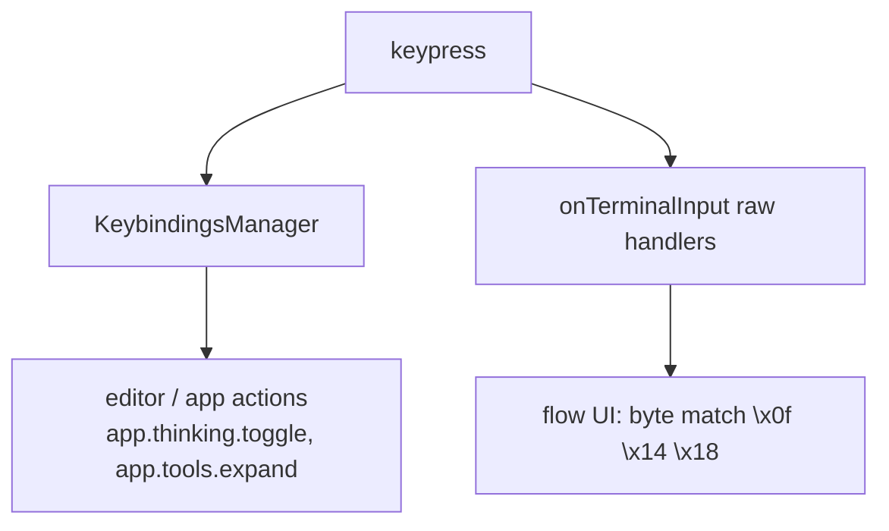
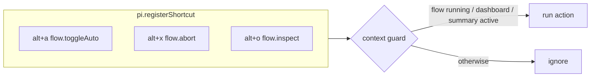

# Design — Move flow keybindings to `alt+<letter>`

## Two input pipelines (the root cause)

The flow handlers match raw control bytes and never consult the manager. When pi-ai later
bound `ctrl+o` → `app.tools.expand` and `ctrl+t` → `app.thinking.toggle` as **global**
defaults, both pipelines began recognizing the same key → double-fire. Raw bindings are
also absent from `keybindings.json`, so users cannot remap them.

## Decision 1 — Target keys: `alt+<letter>`

`alt+a` (AUTO) already lives here and works. pi-ai's default `alt+` space is nearly empty
(editor word-motions only: `alt+b/f/d/y`, `alt+left/right/up/enter/backspace/delete`).
`alt+o`, `alt+x`, `alt+t` are unbound in every default profile.

| Action | Key | Namespaced id (managed) |
|---|---|---|
| Toggle AUTO | `alt+a` | (existing) |
| Abort flow / dismiss summary | `alt+x` | `flow.abort` |
| Inspect / enter navigate mode | `alt+o` | `flow.inspect` |
| Toggle thinking (overlay) | `alt+t` | `flow.toggleThinking` |

## Decision 2 — Route global triggers through `pi.registerShortcut`

Moving to `alt+` already removes the collision, but raw `alt+<letter>` matching is fragile:
the terminal delivers it as the escape sequence `\x1b` + letter, which can race with the
bare-`ESC` handling already in these handlers (and may arrive split across input chunks).
`pi.registerShortcut` parses `alt+` correctly across terminals and makes the binding
user-rebindable. So the **global triggers** (`abort`, `inspect`) move onto the manager,
mirroring `alt+a`.

### Context guards

`registerShortcut` handlers are global, so each guards on flow UI state so they are inert
in a normal editing session:

- `flow.abort` → only acts when `flowManager.isRunning` (or a summary widget is mounted).
- `flow.inspect` → only acts when a dashboard or summary widget is mounted; toggles
  passive ⇄ navigate mode (and acts as the in-mode "exit", replacing the current
  `Ctrl+O`-to-exit branch).

Modal navigation **inside** navigate mode and the overlay (arrows, Enter, Esc, Backspace)
stays on the existing raw/`handleInput` capture — those keys do not collide with pi's
letter-bindings and the modal already consumes all input while active.

## Decision 3 — Overlay thinking toggle

`agent-detail-overlay.ts` is a `uiCtx.custom` modal whose `handleInput(data)` receives raw
bytes. Change its `Ctrl+T` (`\x14`) trigger to `alt+t`. Because the overlay is modal and
captures input while open, match the `alt+t` escape sequence in `handleInput`
(`\x1bt`) rather than registering a global shortcut — keeping the toggle scoped to the
open overlay and avoiding a global `flow.toggleThinking` that would otherwise need its own
"is overlay open" guard. (If a future refactor routes overlay keys through the manager,
`flow.toggleThinking` is the reserved id.)

## Decision 4 — Hints + docs + README correction

Every visible hint string and the README table reflect the new keys. README currently
mis-documents `Ctrl+A` for AUTO (code already uses `alt+a`); fix to `alt+a` in the same
change. `docs/` + `agent-docs/` keybinding mentions are updated via subagent per AGENTS.md.

## Risks

- **Muscle memory:** `Ctrl+X`-to-abort is a strong convention. Mitigated by CHANGELOG note
  and rebindability.
- **Escape-sequence matching in the overlay:** `alt+t` as `\x1bt` must not be mistaken for
  bare `ESC` (close). Order the `handleInput` checks so the two-byte `alt+t` is tested
  before the single-byte `ESC` branch, and verify against the terminal's chunking.
- **Discoverability:** `alt+` is less obvious than `ctrl+`. Mitigated by the on-screen
  footer hints, which always show the live binding.
