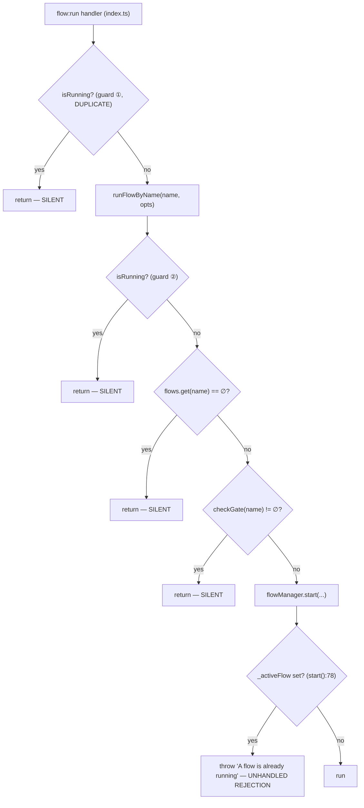
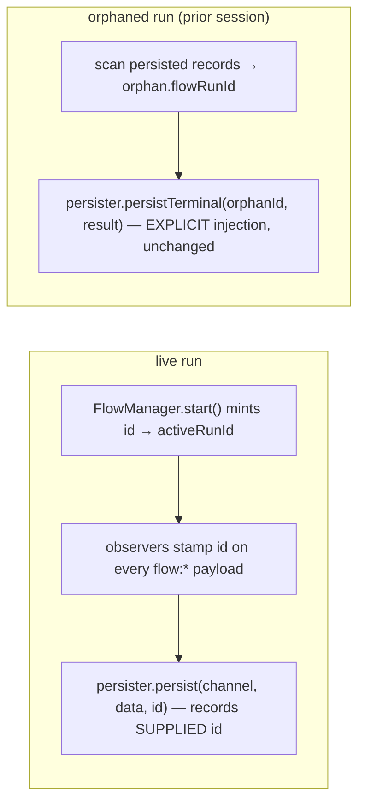

# Design

> **Full investigation + evidence** (five explored threads, `file:line` verified across
> pi-flows / dashboard / runtime): `research/flow-run-event-surfacing-and-run-identity.md`.
> This change implements the **minimal shape** settled there: run-id-on-payload + the
> **C-a** terminal rejection (reuse `flow:complete`, zero dashboard change) + the atomicity
> trio. `flow:notify` parity, a correlation token, `flow:prompt-request`, Option A (typed
> stream), Option B (kill the monkey-patch), and three dashboard bugs are explicitly out of
> scope and tracked in the research note / aggregator.
>
> **Rejection contract (the deliverable):** a declined `flow:run` emits a terminal
> `flow:complete` with top-level `status:"rejected"` + `reason` (byte-identical to the
> command-path strings via a shared builder), `flowName`, and `reason` mirrored into
> `lastResult.result.summary`. `results` omitted (skips the post-flow summary); no `runId`.
> Renderable by a consumer that never saw `flow_started`; finalizes an automation run via the
> existing `flow_complete` completion with no dashboard change.

## The decline map (verified against source)

`extensions/flow-engine/index.ts` — the `flow:run` handler and its sole callee `runFlowByName`:



Four silent returns **plus** one throw. The command path (`registerFlowCommand`) emits `flow:notify` (level `error`) for the unknown-flow / already-running / gate-blocked cases; the `flow:run` path emits nothing for any of them, and its `start()` throw is currently unreachable *only because* guards ① and ② short-circuit first.

`runFlowByName` has exactly one caller (the handler) and is not exported — so this handler is the whole programmatic surface.

## Q2 — the `start()` race (the reason guard ① cannot simply be deleted)

`FlowManager.start()` (`flow-manager.ts`):

```
:78   if (this._activeFlow) throw           ← CHECK
:86   ioAdapter.onFlowStart?.()               (sync)
:90   for (obs) obs.onFlowStarted?.()         (sync)
:92   const { runFlow } = await import(...)  ◀── YIELD
:94   const promise = runFlowFn({...})
:159  this._activeFlow = { promise, ... }    ← ASSIGN
```

Between CHECK and ASSIGN there is an `await`. Two `flow:run` events arriving within that window both see `_activeFlow === null`, both pass all guards, and both call `start()` → **two concurrent runs**. Consequences:

- `:159` overwrites the first run's `_activeFlow`; the first run's `abortController` becomes unreachable → `flow:abort` silently no-ops on it.
- the first run's `finally` (`:164`/`:170`) nulls `_activeFlow` while the second is still live → `isRunning` reports false, re-opening the gate for a third.
- both runs emit `flow:flow-started`; under the *old* persister the `flowRunId` rotates twice and the first run's later events get persisted under the second run's id.

Window width: wide on the session's **first** flow (`await import` does real module I/O), microtask-narrow but non-zero afterward. Two REST dispatches milliseconds apart hit exactly this.

**This is the same failure mode as a double-loaded engine** — two concurrent runs sharing one process and one on-disk state — reachable with a single correctly-installed engine.

**Decision (Q2 = all three, indivisible):**
1. **Delete guard ①** so dispatch has a single choke point.
2. **Make check-to-assign atomic:** mark the run active *before* the first `await` in `start()` (assign a sentinel / set `_activeFlow` up front, then fill in `promise`/`abortController`), so a second synchronous-then-awaiting entrant sees it and takes the decline path.
3. **Wrap the handler's `start()` call** so the now-reachable "already running" throw is converted to the same observable rejection as the pre-checks — never an unhandled promise rejection.

Doing any two of the three is a regression: delete ① without the atomic fix widens the race; the atomic fix without the wrap turns a silent drop into an unhandled rejection.

> Why the run id makes this *visible*, not just fixed: before this change two concurrent runs interleave into one event stream under one clobbered id. A run id on live payloads is the only thing that would surface the interleave to a consumer — so Q2 (correctness) and run identity (observability) genuinely belong in one change.

## Q1 — where the run id is minted (Fork C)

Fork A (getter on the persister) is **struck**: `EventEmitObserver.emit` calls `pi.events.emit(channel, data)` *before* `persister.persist(channel, data)`, and the persister is where the id is minted today — so on `flow:flow-started` (the id-minting event) the id does not exist when the live emit fires. Fork A would require reordering persist-before-emit, which changes the persistence error contract (a throwing emit would leave a record for an event that never went live). Rejected.

Fork B (mint in `EventEmitObserver.onFlowStarted`) puts identity on one observer while `TuiFlowObserver`, the abort path, and `buildRunState` all want it; and its mint site sits *inside* the race window, so two concurrent runs each mint an id unreachable from `FlowManager`. Rejected.

**Decision — Fork C:** `FlowManager.start()` mints the run id, run-scoped, before the first `await` (co-located with the atomicity fix), exposes it as `activeRunId`, and passes it to every observer via the `FlowObserver` signatures. The `EventEmitObserver` stamps it onto every payload it emits; the persister records the **supplied** id instead of self-minting.

### Reconcile carve-out (must be preserved, not "unified")

`reconcileOrphanedRun` runs precisely when there is **no live run** (the orphan is from a prior session), so `flowManager.activeRunId` is useless to it by construction. It already deliberately bypasses `this.emit` and calls `persister.persistTerminal(orphan.flowRunId, result)` with the orphan's id read from disk. This explicit-injection path SHALL be preserved verbatim — do not route it through the live handle, or cold-resume idempotency (`flow-orphan-reconciliation`) breaks.



## Q3 — rejection payload shape

`flow:notify` reaches a dashboard host via the bridge's EventBus catch-all (unknown channels forward as-is), but only as prose. **Decision:** keep `message` + `level` **byte-identical** to the command path (TUI parity, zero risk), and add additive structured siblings on the same payload:

```
flow:notify {
  message: string,   // identical string to registerFlowCommand's
  level: "error",
  flowName: string,  // NEW — the flow that was dispatched
  reason: "unknown-flow" | "already-running" | "gate-blocked",  // NEW
  correlationId?: string   // NEW — echoed iff the caller supplied one on flow:run
}
```

No new channel, no new taxonomy — existing consumers (the TUI's `flow:notify` handler) ignore the extra keys. `reason` lets a host branch programmatically instead of regexing English; `correlationId` lets a host that fired several dispatches bind a rejection back to the request that lost.

Caller token: `flow:run` MAY carry an optional `correlationId`. It is echoed on rejection when present. (It is **not** adopted as the run identity — the run id stays engine-minted per Q1; adopting a caller token as identity was not decided here.)

## Q4 — which channels carry the run id

Core-11 (`FLOW_EVENT_NAME_MAP`): `flow:flow-started`, `flow:agent-started`, `flow:agent-complete`, `flow:assistant-text`, `flow:thinking-text`, `flow:subagent-tool-call`, `flow:subagent-tool-result`, `flow:auto-decision`, `flow:loop-iteration`, `flow:agent-error`, `flow:complete` — **plus** `flow:prompt-request` (a host answering a prompt otherwise cannot tell which run asked; reachable in a long-lived session and, per Q2, under concurrency).

**Deferred:** `flow:summary-started` / `flow:summary-ready` are emitted by the separate `flow-summary` sub-extension, post-run, and carry only `flowName` (two runs of one flow indistinguishable — the exact defect req identity names). Including them widens the blast radius past the engine for a weaker payoff. Recorded here as known-incomplete; a follow-up may add them.

## `FlowResult` typing

`FlowResult` (`types.ts`) is a pure domain object (`{ lastResult, results, forks, flowName, stepCount, totalDuration, status? }`), carried directly as the `flow:complete` payload — no envelope. **Decision:** add a run-id field to `FlowResult` (additive, mirrors the existing `status?` "absent on legacy results" caveat), rather than wrapping the payload for one channel and breaking payload symmetry. `reconcileOrphanedRun` then sets it to `orphan.flowRunId` naturally. This touches `docs/public-api.md`.

## Known interaction — packaging double-load (context only, no guard implemented)

When the engine loads twice in one session (global install + a bundled dependency that lists it in its own `pi.extensions`), two `flowManager` instances and two `flow:run` listeners exist. A single `flow:run` then yields **two** rejection notifies (or one notify + one silent start) and **two** run ids for what the operator sees as one run — the same concurrent-run shape as the Q2 race. Every pi dedupe layer keys on an absolute path, and the two copies sit at different paths, so none merge. Where the fix belongs (pi runtime dedupe by npm name / consuming package drops the bundled entry / a `globalThis` single-init guard here) is an **open decision, not taken in this change**. Recorded so this change does not make the hazard harder to detect; no guard is added on the strength of this note alone.

## Out of scope

- **drop→queue** for the already-running case. This change keeps decline behaviour identical; changing it to queue/defer is a separate, un-taken decision.
- Session/keeper teardown (host concern).
