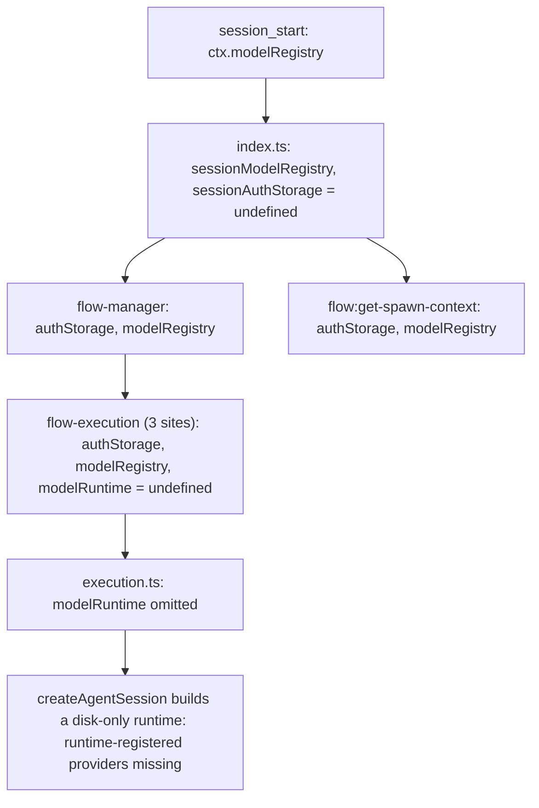

## Context

See proposal.md (Why). Current wiring on pi 1.x:

Relevant pi facts (from pi 1.0.3 source):
- `createAgentSession` uses `options.modelRuntime ?? ModelRuntime.create({ authPath, modelsPath })`.
- Each request resolves provider and key via `runtime.prepareRequest(model)`, which looks up `model.provider` in the session's own runtime. The model object does not carry the key.
- `pi.registerProvider()` writes into the registering session's runtime only.
- `ModelRegistry` (what extensions see as `ctx.modelRegistry`) wraps the runtime in `private readonly runtime`. There is no public accessor.
- Flow agent sessions load only pi-flows' guard extension, so nothing re-registers providers in them.

Model resolution (`model:resolve`, then the registry fallback) already works and is unchanged.

## Goals / Non-Goals

**Goals:**
- Every flow-spawned agent session uses the parent session's runtime.
- Works without the dashboard (plain TUI with extension-registered providers).
- Remove plumbing pi no longer reads.

**Non-Goals:**
- Inheriting the parent's model or live thinking level.
- Per-step `thinking:` overrides in `flow.yaml`.
- Changing `model:resolve` or its probe shape (no `probe.runtime`).
- Fixing pi-dashboard-subagents or the dashboard comment/spec. Those are separate repos.

## Decisions

1. **Get the runtime directly from the parent's `ModelRegistry`, in one helper.**
   A `getModelRuntime(registry)` helper reads `(registry as any).runtime` and returns it only if it looks like a runtime (it has `prepareRequest`/`getModel` functions). Otherwise it returns `undefined`.
   *Alternative:* hand the runtime over through `model:resolve` (`probe.runtime`). Rejected because it makes keys depend on the dashboard, breaks standalone TUI with extension providers, and mixes a per-session object into per-reference resolution.
   *Alternative:* mirror `providers.json` into `models.json`/`auth.json`. Rejected because it creates two sources of truth and only helps the dashboard.

2. **Capture once at `session_start` and pass the runtime object, not a copy.**
   Store it next to `sessionModelRegistry`. Providers registered after `session_start` stay visible because the object is shared.

3. **Thread it through the existing options.** Replace `getAuthStorage` with `getModelRuntime` in the `FlowManager` config. `flow-manager` sets `modelRuntime` on the `runFlow` options. Delete `authStorage` from `RunFlowOptions`/`SpawnOptions` and from the three `flow-execution` pass-through sites, keeping `modelRuntime`. Keep `modelRegistry` only where model resolution still reads it. Otherwise remove it.

4. **`flow:get-spawn-context`** adds `data.modelRuntime` and drops `data.authStorage`, which is always `undefined` on pi 1.x. `data.modelRegistry` is kept for consumers that resolve models.

5. **Fallback registry:** `resolveModel` gets an optional `registry` argument (or reads a registry getter). Production passes the session registry captured at `session_start`, and only falls back to `pi.modelRegistry` when none is captured (tests and older hosts). *Alternative:* assign `pi.modelRegistry = ctx.modelRegistry` in `session_start`. Rejected because it mutates the host's API object.

6. **Thinking levels:** add `"max"` to `ThinkingLevelString` and `VALID_THINKING_LEVELS`. Document it.

## Risks / Trade-offs

- [pi renames or removes the private `runtime` field] → The helper returns `undefined`, agents fall back to disk-only (the old behaviour), and the real-registry test fails in CI, so the problem is caught. File an upstream request for a public accessor (`ctx.modelRuntime` or `ModelRegistry.getRuntime()`). When it lands, only the helper changes.
- [Shared runtime means the agent shares the parent's provider state] → This is intended and matches pre-0.80.8 behaviour. It shares providers and keys only, not session or model state.
- [`flow:get-spawn-context` drops `authStorage`] → The value was always `undefined` on pi 1.x, so no consumer can rely on it.

## Migration Plan

No user migration needed. Rollback means reverting the commit (agents go back to disk-only runtimes). Before merging, do a manual check: run a TUI flow with an agent on a provider registered via `pi.registerProvider`, once on the base commit (expect failure) and once with the change (expect success).

## Open Questions

- Whether to file the upstream pi request for a public runtime accessor now or later. This doesn't affect this change.
