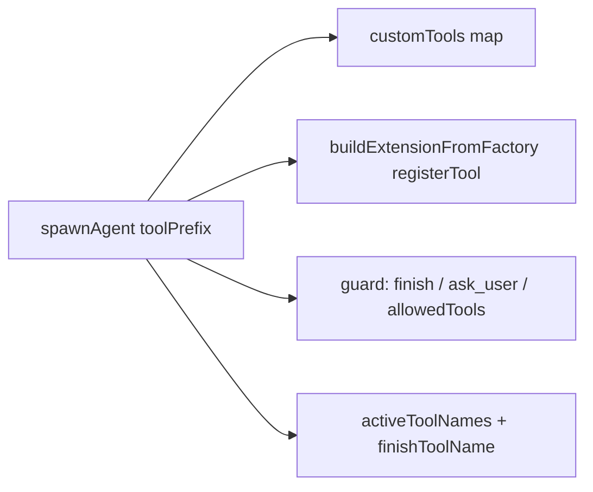

## Context

`spawnAgent` sets `toolPrefix = "mcp__flows__"` when `model.api === "anthropic-messages"`. The prefix is then applied at registration time in four places:

`pi-anthropic-messages` is loaded into each agent in-process by pi-flows' own `anthropic-messages-adapter.ts`, the first `extraAgentExtensions` entry. The bridge plugin also emits it via `flow:register-agent-extension`, so with the bridge it's loaded twice. That's harmless, because both directions are idempotent (verified by smoke test). It renames tools on the wire and reverses the rename on `message_end`, using a reverse map built from `getAllTools()`. It deliberately skips any name that already starts with `mcp__`, both outbound and in the reverse map. So pi-flows' prefixed names reach the events unchanged (see proposal.md, Why).

## Goals / Non-Goals

**Goals:**
- One naming model: pi-flows always uses plain pi tool names, and provider extensions own wire renaming.
- Remove `tool-prefix.ts` and all `toolPrefix` plumbing.

**Non-Goals:**
- No changes to `pi-anthropic-messages` or the dashboard.
- No runtime detection of, or warning about, a missing bridge or anthropic extension. It may be added later as a separate change.
- No stripping of `mcp__flows__` from persisted or historical tool-call records of past runs.

## Decisions

1. **Remove the prefix unconditionally, rather than skipping it only when the bridge is detected.** Detection would keep both code paths alive and couple pi-flows to knowing which extensions were registered. The supported setup for Anthropic OAuth is the bridge plugin, which loads the wire renamer into every agent. *Alternative rejected:* strip the prefix only for display in `onToolCall`. That hides the symptom while the agent's real tool names stay wrong, and it duplicates the work of the wire layer.
2. **Delete `tool-prefix.ts` rather than turning it into a no-op.** It has no external consumers: it isn't exported from `extensions/index.ts` and isn't in `docs/public-api.md`. Leaving dead helpers invites reintroduction.
3. **Remove the guard's `toolPrefix` option** rather than ignoring it. `GuardOptions` is internal, and keeping a field that does nothing would be misleading.
4. **The faux harness keeps its `modelApi` option.** Tests still drive `anthropic-messages` to prove the plain-name path. Only the prefixed-finish branch goes.

## Risks / Trade-offs

- [An Anthropic OAuth user runs flows without `pi-anthropic-messages` installed. Anthropic then rejects the request ("out of extra usage") and every agent fails.] → Document the requirement in the README and CHANGELOG as breaking. Old code worked without the package because of the `mcp__flows__` prefix.
- [With the bridge enabled, the renamer is loaded twice per agent.] → Harmless: outbound skips `mcp__` names, and inbound renaming does nothing on plain names. Deduplicating the adapter and bridge factories is a possible follow-up.
- [API-key `anthropic-messages` endpoints never needed the prefix.] → No risk. Removing it is strictly correct for them.
- [Old run records contain `mcp__flows__*` names.] → Accepted. They are historical display data only.

## Migration Plan

Ship in a minor version with a CHANGELOG **BREAKING** note: "Anthropic OAuth flows require `pi-anthropic-messages` + `flows-anthropic-bridge-plugin`." To roll back, revert the release. No persisted state changes shape.
