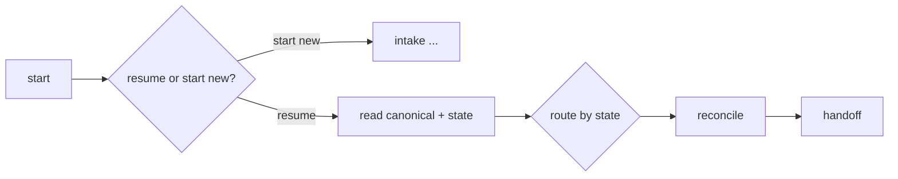
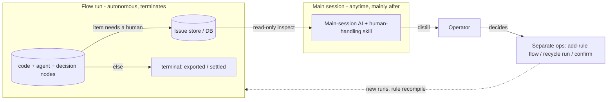
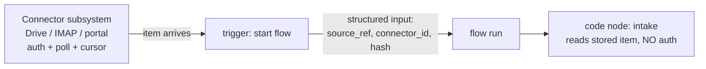

# Flow Rework & Code-Node Capability Plan

> **Status:** exploratory design (living doc). Not a spec. Captures the rework
> direction for pi-flows derived from the InvoiceBot production flow + the
> AI/human review-and-handle vision. Update this file as the design evolves.
> (Note: an early draft framed this as "steering" — superseded: flows are
> autonomous & terminal; humans REVIEW recorded issues, they do not steer runs.)

> **Lens:** InvoiceBot (`~/BB/InvoiceBot`, functional-spec v0.4) is the
> reference production consumer — a deterministic-by-mandate invoice pipeline
> with many human gates. It is how flows get used in production *and* the same
> shape as casual prompting (plan → execute → review). If the rework serves
> InvoiceBot, it serves both.

> **SCOPE — this doc is about the FLOW ENGINE only.** It answers "where do
> *flows* need to improve for the tasks they must do." pi-flows is **not** a
> whole-framework; the surrounding pieces are **separate systems** and are
> named here but **not designed**:
>
> | Separate system (NOT flows) | Owns |
> | --- | --- |
> | Main-session reader (tools + skill) | reading/distilling exposed run+issue state for the operator |
> | Memory / pattern-notice (FR-CFG-3) | remembering recurring instances, *proposing* rules |
> | Connector / trigger / secrets (CONN) | auth, polling, starting runs with input |
> | Domain flows + tools (`ib_*`) | rule packs, approval-record, recycle, partner registry |
>
> The flow engine's job is to **produce** typed results, **record** issues, and
> **persist/expose** run state — so those other systems can consume it. It does
> not read, distill, remember, authenticate, or resolve.

---

## 0. Executive summary — what is ACTUALLY needed

The long exploration below resolves to **three** engine-level essentials:

1. **OBJECT PASSING + JIT-stringify at the LLM/template boundary** — the n8n
   model. Objects flow `code -> code` as-is; serialize to a string **only** when
   entering an agent prompt or a `${{...}}` template; **big data is never
   injected** — pass a **path** and the agent reads it JIT via its `read` tool
   (best practice; no `file://`, no claim-check). Kills the string-only data
   plane that forces `JSON.stringify`/
   XML at every edge. **≈ 90% of the value** — once this lands, the
   recorder-code-node pattern, clean decisions, and distillable state fall out.
2. **RUN-STATE EXPOSURE (thin read seam)** — persist + expose live/historical
   run+node state so a *separate* reader can review runs. Mostly already exists
   (`persist-flow-runs`). The reader/skill are NOT the engine.
3. **TYPED FLOW INPUT (trigger edge only)** — start a run with `{source_ref,…}`
   instead of one `task` string. Needed for the connector/production path; skip
   for casual one-string prompting.

Everything else is **already expressible** (recording = decision-route → terminal
code node + store write), **polish** (timeouts/retry, `ctx.state`/`ctx.results`),
or a **separate system** (reader, pattern-notice memory, connectors, domain
resolution flows).

### ✅ RESOLVED — resume is a FLOW-ARCHITECTURE pattern, not an engine feature

**Decided: terminate + continuation run, with resume expressed in the DAG
topology — no engine suspend/resume.**

- The invoice is **persisted as its canonical form** (domain store).
- The flow opens with a **first decision node** (`code-decision`/`fork`):
  **"resume or start new?"** — *start new* runs from the top; *resume* reads the
  persisted canonical + saved `state` and routes to the node that state implies
  (e.g. `approved` → jump to `reconcile`).
- A continuation is just a **new run** taking the *resume* branch. Engine needs
  nothing new beyond **typed flow input (#3)** to carry `{ source_ref }` in + a
  store to read from.



This **resolves GAP 1** (the blind analysis wanted durable suspend/resume): we
get resume *behavior* from DAG routing + a persisted form, at zero new engine
cost. "One invoice = a state machine of runs" is the accepted shape.

**Composition: `flow-ref` stays removed (already done).** Build **one flow** and
**duplicate shared components inline** rather than compose via sub-flow
indirection — deliberately less risk (no hidden cross-flow coupling, one
auditable graph). This **resolves GAP 2**.

<details><summary>Original open-decision framing (now resolved — kept for history)</summary>

**How does a human-needed invoice continue *after* approval?**

|                 | Our model (chosen)                                                                                  | Independent analysis prefers                                                              |
| --------------- | --------------------------------------------------------------------------------------------------- | ----------------------------------------------------------------------------------------- |
| Mechanism       | run **terminates** at the gate (recorded); a **new continuation run** advances the approved invoice | **durable suspend/resume**: one run pauses for days, resumes the *same* DAG               |
| Engine cost     | low — no suspend infra; needs typed flow input (#3) + a store                                       | high — checkpoint a running DAG + resume across sessions (pi-flows explicitly lacks this) |
| Lifecycle shape | "one invoice = a **state machine of runs**"                                                         | "one invoice = **one immutable resumable flow**" (matches spec P1 literally)              |

The blind subagent (no knowledge of our chats) independently ranks
**suspend/resume as the single highest-leverage change**, calling our
terminate+continuation approach the "fracture the pipeline" workaround that
fights the spec's single-immutable-flow goal. We deliberately chose
terminate+continuation for engine simplicity. **This is the decision to revisit**
if honoring "one resumable flow per invoice" matters more than keeping the engine
small. See §11 for the full independent findings.

</details>

---

## 1. The vision in one picture  (NOT steering — record & review)

Flows today solve **orchestration** (a static DAG of plan + execute steps). The
missing piece is **overview / review**: flows run unattended and **terminate**;
any item needing a human is **recorded as an issue in a durable store** on the
way out (the run does NOT pause and wait). A **separate main-session layer**
(its own tools + skill — *not* designed here) reads those exposed issues anytime
and the human acts through **separate operations**. The flow engine's only job
is to **record** the issue and **expose** the state — not to read or resolve it.

> **There is no "steering."** We do not reach into a running DAG, resume a
> paused node, or override a decision mid-flight. Runs are autonomous and
> terminal; humans review the *records* afterward.



What the **flow engine** must add (everything else is a separate system):

- **Record — needs NO new engine primitive.** "Recording an issue" is just a
  **terminal `code` node** that a decision node routes to: it receives the
  typed decision + AI response (via `inputs`/`results`), writes
  `{ item, decision, ai_response, state:"needs_human", trace }` to a store
  (a domain DB, or `ctx.state`), and ends the run (no `on_complete`). The
  "holding state" is just a value it saves — not an engine concept. *(uses
  existing decision-routing + code node; P2 makes the data clean.)*
- **Expose** — run + node state are **persisted and readable** (extend
  `persist-flow-runs`; emit events) so an external reader can query live +
  historical runs. The engine exposes; it does **not** read/distill. *(engine,
  thin — mostly already exists.)*

NOT the flow engine: the main-session reader tools + skill, the memory that
notices patterns (FR-CFG-3), and the out-of-band resolution ops (add-rule,
recycle, approve). Today only the final `summary` returns; a finished run is a
black box and issues vanish — the engine fixes *that*.

---

## 2. The code node is the backbone — and underpowered

In InvoiceBot, **9 of 13 steps are code / code-decision** (intake, classify-gate,
match-partner, evaluate-approval, approval-gate, reconcile, handoff, park, done).
The deterministic spine *is* code nodes. So every capability we add to the code
node multiplies production power directly.

### 2.1 What `CodeNodeContext` is today (grounded in source)

```ts
interface CodeNodeContext {
  signal: AbortSignal;            // cooperative cancel (flow abort / timeout)
  cwd: string;                    // project root
  logger: (msg: string) => void; // → step card
  setSummary: (text: string) => void;
  flowName: string;
  stepId: string;
  task: string;                   // flow's overall task
}
```

Contract: inputs are **strings** (template-expanded); output must be an object
whose keys exactly match declared `outputs`; values are coerced
(`string` pass / `number|boolean|bigint` → `String()` / `object|array|null` →
**soft failure**). Handler is the module default export, co-located at
`<flow-dir>/<id>.ts`, dynamic-imported. Optional soft `timeout`.

### 2.2 What the code node CANNOT do today (gaps the rework needs)

| Missing capability                              | InvoiceBot need                                                                                                                    |
| ----------------------------------------------- | ---------------------------------------------------------------------------------------------------------------------------------- |
| **Structured (non-string) I/O**                 | `evaluate-approval` returns `decision` + `route_effect` (JSON) + `matched_rules` (array) + `trace`. Today all must be stringified. |
| **Surface a checkpoint to the main session**    | "3 parked, 1 awaiting >1M HUF approval" must reach the operator mid-run.                                                           |
| **Pause and ask the human / main session**      | `human-approval`, `confirm-partner` are inherently interactive; only `fork` can pause today.                                       |
| **Durable run/item state read-write**           | pipeline state + settlement state + `decisions[]` audit live in a store, not flow results.                                         |
| **Read upstream results beyond wired `inputs`** | reconcile needs "all outstanding invoices", not just one wired value.                                                              |
| **Per-step retry policy**                       | flaky connectors / extraction need bounded retry+backoff.                                                                          |

---

## 2.5 Flow INPUT is one freetext string — and connectors are the wrong job for a code node

### Flow input today

`FlowConfig` has **no input declaration**. The entire input surface a flow
receives at invocation is a single `task: string` (from `/flow <args>` or a
`task_required` prompt). `TemplateContext` confirms: `task` (string) + per-step
`inputs` + prior `results`. There are **no typed flow parameters, no structured
payload, no named flow-level inputs.**

For InvoiceBot this is a wall: `intake` needs *which item, from which connector,
with what SourceRef/hash* — today that must be crammed into the freetext `task`
and re-parsed. **Rework needed: a typed/verbose flow input contract** — an
`inputs:` schema on `FlowConfig`, populated as a structured object at
invocation, surfaced as `${{flow.input.<name>}}` and as structured data to code
nodes (change **P6**).

### Can a code node do "from Google Drive auth" / "from email"?

```
Mechanically:  YES  — a code node is raw in-process TS; nothing sandboxes it.
                      It can import googleapis / an IMAP client / fetch().
Practically:   NO   — missing structured input, a secrets channel, a
                      connector/trigger model, durable cursor state, and
                      background execution. And it is the WRONG SHAPE.
```

The five blockers (none exist on `CodeNodeContext` today):

1. **No structured input** — only string `inputs` + the one `task` string;
   nowhere clean to wire "which folder / mailbox / account."
2. **No secrets/credentials channel** — OAuth/refresh tokens, IMAP passwords
   have nowhere governed to live.
3. **No connector/trigger model** — flows are command-invoked; a code node runs
   **once** when the DAG reaches it, it cannot be a long-lived listener/poller.
4. **No durable cursor state** — polling needs "last seen"; `ctx.state` absent.
5. **In-process, soft-timeout only** — a watch/long-poll blocks the flow.

A connector is a **long-lived event source that starts flows**; a code node is
a **one-shot processing step inside** a flow. InvoiceBot already separates them:
intake stores the item, `SourceRef` points to it, the flow processes one
already-fetched item per run.



**Decision:** connectors / auth / triggers / secrets are a **separate subsystem**
(change **CONN**), NOT a code-node capability and NOT in the flow-engine core.
The code node only ever *processes* an item handed to it via structured input.

---

## 3. THE SPLIT — extend the code node vs. separate change

This is the core decision. Principle: **the code node is the deterministic
compute + I/O surface; the engine owns scheduling, transport, and cross-node
concerns.** Anything a single node *produces or consumes* belongs on the node;
anything about *how nodes relate, persist issues, fan out, or are read back by
the operator* is engine-level.

### 3.1 Belongs to the CODE NODE (extend its context + contract)

| Capability                                     | Shape                                                                  | Why it's a node concern                                                                                                                                                                                            |
| ---------------------------------------------- | ---------------------------------------------------------------------- | ------------------------------------------------------------------------------------------------------------------------------------------------------------------------------------------------------------------ |
| **Structured outputs** (P2-core)               | output values may be JSON (object/array), not forced to string         | It's the node's return contract. Removes the `JSON.stringify`/XML-`artifacts` footgun. Big data stays a file path the agent reads JIT (D-Context).                                                                                      |
| **(issue recording)**                          | NO dedicated method needed — a terminal `code` node writes the decision to a store (domain DB or `ctx.state`) and ends the run | Recording is just decision-routing → end code node + a store write. "Holding state" is a saved value, not an engine feature. |
| **`ctx.state`**                                | run/item-scoped durable kv (get/set)                                   | A generic persisted handle the node reads/writes. The *domain* store (partner registry, rule packs) stays InvoiceBot's own import; the engine provides only the generic run-scoped channel.                        |
| **`ctx.results` (read-only)**                  | accessor for any completed upstream step's typed result                | Convenience beyond wired `inputs`; the data already exists in `FlowContext`.                                                                                                                                       |
| **Per-step `retry` honored by code execution** | `retry: { max, backoff }` re-invokes the handler on soft failure       | The node's own execution policy (engine parses; executor applies).                                                                                                                                                 |

> **Big simplification:** human-needed handling = a decision node routes to a
> **terminal `code` node** that saves the item (PDF handle + canonical + trace +
> `route_effect`) to a store and ends the run. No new node type, **no
> `recordIssue` primitive, no holding-state engine concept, no pause/resume** —
> just existing routing + a code node + a store write. P2 makes the data clean.
> The declarative `fork` stays for simple inline-choice cases.

### 3.2 Needs a SEPARATE change (engine / main-session / other surfaces)

| Capability                                      | Why NOT the code node                                                                                                                                                        |
| ----------------------------------------------- | ---------------------------------------------------------------------------------------------------------------------------------------------------------------------------- |
| **Issue store + read-back**                     | A durable store for recorded issues + run/node state; how it is read by the main session. Engine + persistence plumbing, shared by all node types (agents too).              |
| **Expose run/issue state** (read API + events)  | The engine PERSISTS + EXPOSES runs/nodes/issues so an external reader can query them. The *reader tools/skill* live in the main session — out of scope. Not a node concern.  |
| **Agent-node issue recording**                  | Agents must record issues too (e.g. low-confidence classify); that's the guard/agent-session path, not code context.                                                         |
| **Map / fan-out node** (P4)                     | Scheduling N instances over a collection + gather is a DAG/scheduler feature. The code node merely *produces* the collection (now possible via structured outputs).          |
| **Agent + decision timeouts** (P5)              | Symmetry across node types; engine-level, not a code-context method.                                                                                                         |
| **Big-data handling** — RESOLVED, no engine change | NOT a blob store / claim-check. Pass a **path**; the agent reads JIT via its existing `read` tool; code nodes `fs`-read. `file://` eager injection is **dropped**. See D-Context. |
| **(holding states)**                            | NOT an engine feature — a "holding state" is just a value a terminal code node saves to the store (`needs_human`/`partner_pending`/…). Reached by ordinary decision-routing. |

---

## 4. Proposed change set (code-node-centric framing)

```
P2  structured-result-channel   [TOUCHES CODE NODE CONTRACT + engine result model]
      • code/agent outputs may be structured JSON (drop forced string coercion)
      • big data (PDF, statement): pass a PATH; agent reads JIT via read tool
        (drop file:// eager injection; no claim-check) — see D-Context
      • demote fullOutput / XML-artifacts from the template surface
      → prerequisite for clean Surface + Inspect

P1  expose-run-state             [ENGINE — thin; mostly already exists]
      • issue RECORDING is NOT here — it is a terminal code node + store write,
        reached by existing decision-routing (no recordIssue, no holding-state
        engine concept). See §3.1.
      • the only engine bit: persist + EXPOSE live + historical run/node state
        (extend persist-flow-runs; emit events) so an external reader can query
      • NO steering: no write-back into a live run, no pause, no resume
      — NOT here: the main-session reader tools+skill, the pattern-notice
        memory (FR-CFG-3), and the out-of-band resolution ops are separate
        systems (see Scope box at top).

CN  code-node-capability         [CODE NODE ONLY — the "do more" bundle]
      • ctx.state (run/item-scoped durable kv)
      • ctx.results read-only accessor
      • per-step retry: { max, backoff }
      • issue recording uses ctx.state (or a domain store) + decision-routing —
        no special context method
      can land incrementally; ctx.state + retry are independent of P1/P2

P4  map-node                     [DROPPED — not a capability gap]
      • deterministic per-item work → a CODE NODE LOOPS internally (just JS)
      • trigger fan-out (N invoices) → CONNECTOR starts child runs (CONN)
      • small batch → give an agent the list in its prompt
      • a map node ONLY adds value for parallel per-item AGENT calls with
        isolation + gather (code nodes can't spawn agents; batching into one
        prompt loses parallelism/isolation/visibility). InvoiceBot has no such
        case → DROP. Revisit only if a real parallel-agent-fan-out case appears.

P5  step-robustness              [ENGINE — symmetry]
      • timeout on agent + decision nodes (today: code only)
      • per-step retry honored across node types

P6  typed-flow-input             [ENGINE — invocation contract]
      • FlowConfig `inputs:` schema (named, typed, structured)
      • populated at /flow invocation + flow:run; surfaced to all steps as
        ${{flow.input.<name>}} and as structured data to code nodes
      • replaces cramming everything into the one freetext `task` string
      pairs with P2 (structured data plane)

CONN connector-trigger-subsystem [OUT OF ENGINE CORE — InvoiceBot-adjacent infra]
      • long-lived event sources (email IMAP/Graph, Google Drive, web portal)
      • auth (OAuth/refresh tokens), polling, durable cursors, secrets channel
      • on new item: store verbatim + hash, START a flow with P6 structured input
      • code nodes NEVER authenticate/poll — they process an already-fetched item
```

**Critical path:** **P2 is the one that matters** — typed data is what lets a
terminal code node record a clean decision (and lets exposed state be
distillable). `CN`, `P5`, `P6`, and the thin `P1` (expose) are independent.
`P4` (map) is dropped; `CONN` is out of engine core.

**What is explicitly NOT in the engine:** issue recording (a terminal code node
+ store write), the InvoiceBot domain store, NAV validation, rule-pack
compilation, connectors, the reader, the pattern-notice memory. The engine
provides generic primitives (typed results, `ctx.state`, exposed run state); the
domain builds recording + review on top.

---

## 5. Determinism guardrail (do not break)

InvoiceBot mandates an **immutable, hash-guarded deterministic base flow** (P1,
FR-CFG-4): deterministic rules run unattended; only judgment/human points may
surface. Therefore:

- **Recording is just routing to a terminal code node.** A decision node routes
  the human-needed branch to a code node that saves the item and ends the run;
  the deterministic spine that doesn't branch there runs straight through.
- That recorder node **does not pause** — it writes to the store and the run
  ends; nothing waits. (No `recordIssue` primitive, no holding-state engine
  concept; "holding state" is a saved value.)
- Structured outputs and exposed run state do **not** introduce nondeterminism,
  and **exposure is read-only** — nothing can alter a run after the fact.

Unattended throughput is the default; recorded items are reviewed later from
the main session. **No mid-run human dependency, no resume.**

---

## 6. DECISIONS (confirmed with maintainer)

### D-Record — recording is a terminal code node, NOT an engine primitive (CONFIRMED; supersedes earlier "D-Queue/steering" and "ctx.recordIssue")

There is **no steering, no pause/resume, and no `recordIssue` primitive.** A
decision node routes the human-needed branch to a **terminal `code` node** that
writes the item to a store (a domain DB, or `ctx.state`) with a saved
`state` value (`needs_human` / `partner_pending` / `review` / `rejected`) and
**ends the run**. "Holding state" is that saved value — not an engine concept.
Other runs are unaffected because each run was independent and already ended.

The operator reviews the accumulated issues **anytime — mainly after runs — from
the main session** ("any issues to resolve?"): a **separate main-session reader**
(its own tools+skill, *not* the engine) queries the engine's exposed state and
distills. The human then acts via **separate operations**, never by re-entering
a run:

- **add a rule** → run the separate rules-activate flow (back-test + consent +
  recompile); future items auto-handle.
- **recycle** → re-process affected items as **new runs**.
- **confirm / record-approval** → a domain tool records the decision; a
  **continuation run** advances the now-approved item (reconcile → export).

Matches InvoiceBot's review-queue (FR-REC-11), stuck-invoice escalation
(FR-APR-4), digest cadence (D8), and the per-invoice approval **link/dashboard**
surface (FR-APR-2). Accumulate-and-review, **read-only**, ungated.

> Supersedes the earlier "Pending Queue / Surface+Steer" framing. Record =
> write an issue + end in a holding state. Review = read-only inspection from
> the main session, anytime. Resolution = separate out-of-band operations.
> **No interrupts, no resume, no write-back into a live run.**

### D-Expose — extend `flow_results`/`FlowEventRecord` to EXPOSE state (CONFIRMED)

The engine's job is to **expose**, not to read. `flow_results` already lists
**finished** runs (reads persisted `FlowEventRecord`s; per-step
`completed`/`skipped`/`pending` already tracked). Extension: also expose
**currently-running** runs and each run's **pending / running / finished /
upcoming** nodes + recorded issues (D-Record) — the same data the dashboard
shows. This is a **read seam** (API + events); whatever *reads* it (a
main-session reader, the dashboard) is a **separate consumer**, out of scope.
The engine never accepts write-back into a run.

### D-Serialize — typed store, serialize only at the text boundary (CONFIRMED direction; best-practice backed)

Decide the *conversion* before the migration. Best practice (Temporal Data
Converters, Workflow DevKit/devalue, n8n, LLM-prompt guidance):

- **The engine result store stays TYPED.** An object stays an object. `code -> code`
  passes the value **as-is, no serialization** (Temporal's typed-payload model).
- **Convert to string ONLY at a text boundary:**
  - agent prompt / `${{result.x.obj}}` template → **`JSON.stringify` (compact by
    default)**; deep nesting wastes tokens, so flatten/compact.
  - **large** values → never inlined: pass a **path**, the agent reads JIT via
    its `read` tool (D-Context). No `file://`, no claim-check.
- **Drop the current "reject object → soft fail" rule.** It was a stopgap to keep
  the all-string interface honest; a typed store makes it unnecessary.
- **Migration is naturally additive / back-compat:** existing flows read string
  fields and keep working (text-boundary rendering is still a string); the only
  new power is objects no longer hard-fail and `code -> code` can pass typed values.
  No hard cut needed.

### D-Context — JIT "reference + read", NOT injection (CONFIRMED; best-practice backed; supersedes D-Claim)

Research (Anthropic *effective context engineering*; Manus; LangChain
*filesystem as context*) is decisive: the field moved **away from preloading
context** toward **just-in-time retrieval** — keep a lightweight **reference**
(path/ID) in the prompt, let the agent **read full content at runtime via its
`read` tool**. Long context degrades reasoning even within the window; the
"filesystem as context" (write-file → downstream-reads) pattern is the endorsed
way to move large/intermediate data. Subagents start with **fresh isolated
context** — the **only** parent→subagent channel is the **delegation prompt**.

Decision for pi-flows:

- **Big / optional / intermediate data → JIT.** Pass a **path as a normal input**
  + an **instruction** to read it; the agent uses its `read` tool (scoped by
  `access.read`). The path is the reference; the `read` tool is the fetch.
- **`file://` eager injection → DROP.** The engine never reads/injects file
  content. (Removes the `file://` resolver + verbatim-inject + sentinel logic.)
- **`read_artifact` / claim-check → NOT NEEDED.** The path + `read` tool already
  are the claim-check.
- **`context_files` → keep ONLY for small, always-needed, critical files** (house
  rules / conventions) where guaranteed presence beats the tiny token cost.
  Large docs use path+read instead.
- **Small scalars** still inline as text (JIT-stringified at the boundary,
  D-Serialize).
- **Code nodes** just receive the path string and `fs`-read it directly.

Authoring caveats (both `flow_write`-checkable): the agent needs `access.read`
covering the path **and** an instruction to read it; the producing step must be
ordered before.

### D-State — code-node state handle WITH cross-run support (CONFIRMED)

Add `ctx.state` on `CodeNodeContext`: **run-scoped by default + opt-in
flow-scoped (cross-run) namespace.** The cross-run bucket lets the engine hold
lightweight durable data without a domain DB — e.g. a connector's "last seen"
cursor, a small partner/alias map, counters for escalation. Heavy domain data
(full partner registry, rule packs) may still live in the domain's own store,
but the engine no longer *requires* one for simple cross-run memory.

## 6b. Still open

1. **Continuation after resolution:** when an item is approved/recycled, the
   follow-on processing is a **new run keyed on the item's persisted state**
   (not a resumed DAG). Open: does the continuation re-enter `invoicebot:process`
   with a state-based entry route, or is there a dedicated `post-approval` flow?
   (Domain concern; engine just starts a fresh run.)
2. **`JSON.stringify` form at the prompt boundary:** compact (token-cheap) vs.
   pretty (mixed evidence on LLM clarity). Lean compact; big data is a path the
   agent reads JIT (never inlined).
3. **Issue retention / dedup:** how long recorded issues live, and how a
   recycled item's old issue is marked resolved/superseded in the store.

---

## 7. Detailed change specs

Each change below is described to the depth needed to seed an OpenSpec proposal.
Shapes are illustrative, not final signatures.

### P2 — structured-result-channel  *(critical-path root)*

**Scope.** Make the engine result store hold **typed values**; serialize to
string **only** at a text boundary; **big data is a path the agent reads JIT**
(no claim-check; `file://` dropped — see D-Context); retire `fullOutput`/
XML-`artifacts` from the primary surface.

**Result store shape (today → target):**

```ts
// today: every field a string
results[id] = { fullOutput: string; status: string; summary: string;
                artifacts: string; files: string }

// target: typed values + standard meta + artifact handles
results[id] = {
  status: "complete" | "error" | "blocked" | "skipped";
  summary: string;                       // human one-liner (stays string)
  outputs: Record<string, unknown>;      // TYPED declared outputs (object/array/number/…)
  files: string[];                        // paths to produced artifacts (PDF, statement);
                                         // agents read these JIT via the read tool (no inject)
}
```

**Marshalling rules (the cross-node contract):**

| Boundary | Rule |
| --- | --- |
| `code -> code` | pass the typed value **as-is** (zero serialization) |
| `-> agent` (prompt / `${{result.x.obj}}`) | `JSON.stringify` (compact) for SMALL values; **large → pass a path; agent reads JIT via its `read` tool (no inject)** |
| `agent ->` (`finish`) | finish schema may declare non-string params; LLM emits JSON; tool validates + coerces to typed |
| `-> fork` (human) | render to UI text |

**Behavior change:** the current `object|array|null -> soft failure` coercion
rule is **removed**. Migration is additive — existing string outputs keep
rendering as strings at text boundaries. **Inspection reads these typed values
read-only; nothing writes back into a run.**

**InvoiceBot payoff:** `evaluate-approval` returns `{ decision, route_effect:{type,value},
matched_rules:[…], trace }` as real typed data; `approval-gate` reads
`route_effect` without re-parsing XML.

### P1 — expose-run-state (thin) + recording is a terminal code node (no primitive)

**Scope.** Two things, both small:

**(a) Recording = a terminal code node + store write — no engine feature.** A
decision node routes the human-needed branch to a `code` node whose handler
writes the item to a store and returns with no `on_complete`, so the run ends.
The record is just an object the handler shapes — e.g.:

```ts
// inside the terminal recorder code node's handler
await ctx.state.flow.set(`issue:${item.id}`, {     // or a domain DB / ib_* tool
  item: input.invoice, decision: input.decision,    // typed, wired from results (P2)
  ai_response: input.ai_response, trace: input.trace,
  state: "needs_human", at: Date.now(),
});
return {};   // no on_complete -> run terminates in this branch
```

No `recordIssue` method, no `on_record` field, no holding-state engine concept.
`"needs_human"` is a value the handler saves. The flow YAML is just:

```yaml
- id: route          # agent-decision or code-decision
  type: agent-decision
  branches: { auto_approve: reconcile, needs_human: record-issue }
- id: record-issue   # terminal code node
  type: code         # writes to store, no on_complete -> ends the run
```

**(b) Expose run state (the only engine bit).** Persist + expose live +
historical run/node state (extend `persist-flow-runs`; emit events) via a
**read seam** (API + events). Whatever consumes it (a separate main-session
reader, the dashboard) is **out of scope**. **No write-back** into a run.

**Resolution (out-of-band, domain):** add-rule flow, recycle as new runs, or a
domain tool that records an approval + starts a continuation run. See §9.5.

**InvoiceBot mapping:** the `needs_human` / `partner_pending` / `review`
branches each route to a terminal recorder code node; all reviewed later from
the main session by reading the store.

### CN — code-node capability bundle

Extends `CodeNodeContext` (all opt-in; a node using none stays deterministic):

```ts
interface CodeNodeContext {
  // …existing: signal, cwd, logger, setSummary, flowName, stepId, task
  results: Readonly<Record<string, StepResult>>;        // read any completed upstream step
  state: {                                              // D-State
    run:  KV;                                           // run-scoped (default)
    flow: KV;                                           // opt-in cross-run (cursors, alias maps)
  };
  // no artifact/claim-check method: big data is a file path the agent reads JIT
  // (D-Context); code nodes fs-read the path directly.
}
```

> No `recordIssue` method: a recorder node just writes to `ctx.state.flow` (or a
> domain store) and ends — recording is a store write, not a context primitive.

Plus per-step `retry: { max, backoff }` honored by the executor on soft failure
(shared with P5).

### P5 — step-robustness (symmetry)

`timeout` and `retry: { max, backoff }` available on **all** node types (today
`timeout` is code-only; no retry anywhere). Agent timeout aborts the agent
session; retry re-invokes on soft failure up to `max` with `backoff`.

### P6 — typed-flow-input

`FlowConfig` gains an `inputs:` schema; invocation populates it as a structured
object, surfaced as `${{flow.input.<name>}}` and as typed data to code nodes.

```yaml
name: invoicebot:process
inputs:
  source_ref:    { type: string, required: true }
  connector_id:  { type: string, required: true }
  content_hash:  { type: string }
```

The one-freetext-`task` path stays as a back-compat default (`${{task}}`).

### CONN — connector / trigger / secrets  *(out of engine core)*

Long-lived event sources that **authenticate, poll, hold cursors, and START
flows** with P6 structured input. Owns a secrets channel (OAuth/refresh tokens,
IMAP creds). On a new item: store verbatim + hash, then start a run. Code nodes
never authenticate or poll. Lives as a downstream package/extension, not the
flow engine.

---

## 8. What the FLOW ENGINE must EXPOSE (the consumer is a separate system)

The earlier draft designed main-session inspect tools + a skill here. **That is
out of scope** — reading/distilling/handling is a separate main-session layer.
This section states only the **engine's contract**: what flows must persist and
expose so *any* consumer can read it.

### 8.1 Engine contract — persist + expose (the engine's only obligation)

The flow engine SHALL make the following **durable and queryable** (extend
`persist-flow-runs` + `FlowEventRecord`; emit events):

- **runs** — id, flow, status, current/holding state (live + historical)
- **per-node state** — pending / running / finished / upcoming + typed outputs
- **recorded issues** — the `FlowIssue` records (§7, P1) with their holding state
- **files** — paths to produced artifacts (PDF, statement); read JIT via the `read` tool
- **trace** — the stored decision trace (so explanations read, never re-guess)

That is the whole engine responsibility: **produce typed results, record issues,
persist + expose state.** The engine does not read, rank, distill, or notify.

### 8.2 Explicitly NOT the flow engine (separate systems — named, not designed)

| Separate system                                 | What it does with the exposed state                                                                                                                                                           |
| ----------------------------------------------- | --------------------------------------------------------------------------------------------------------------------------------------------------------------------------------------------- |
| **Main-session reader** (its own tools + skill) | calls the read API, distills "any issues?", presents to the operator. Mirrors how authoring has `manage-flows` + `flow_*` tools — but that is the *main session's* concern, not the engine's. |
| **Memory / pattern-notice (FR-CFG-3)**          | remembers recurring instances across runs and *proposes* rules. A **separate memory**, not a flow feature.                                                                                    |
| **Domain ops** (`ib_*`)                         | add-rule (back-test + consent), recycle (start new runs), approve/confirm (record + continuation run). Domain tools/flows.                                                                    |
| **Notification**                                | escalations (stuck > T, FR-APR-4) can ride the existing `flow:notify` event, but deciding *when/whether* to notify is the consumer's policy.                                                  |

The engine's only obligation toward all of these is that the data they need is
**there and readable**. How it is consumed is their design, not this doc's.

---

## 9. Worked example — InvoiceBot record-and-review loop end to end

```
1. CONN: invoice email arrives → store PDF + hash → start run R42 with
   flow.input = { source_ref, connector_id, content_hash }            (P6, CONN)
2. R42: intake(code) → classify(agent) → extract(agent) emits canonical (typed) (P2)
3. R42: evaluate-approval(code) → { decision:"needs_human", route_effect:
   {type:"route-to",value:"finance-director"}, trace } (typed)             (P2)
4. R42: approval-decision routes "needs_human" → record-issue (terminal code):
     handler writes { invoice, decision, ai_response, state:"needs_human",
     trace, artifacts:[pdfRef] } to the store; returns {} → R42 ENDS    (code+P2)
     (no recordIssue primitive — just a store write in an end node)
   ... runs R43, R44 ran independently and already finished/recorded ...
5. Operator (chat, next morning): "any issues to resolve?"
     a SEPARATE main-session reader (its own tools+skill — not the engine)
     queries the engine's EXPOSED state → [R42 approval >1M, R45 unknown partner]
     and distills for the operator.                          (§8: engine EXPOSES)
6. Operator: "show me the big one"  → reader queries the exposed step state +
   redeems the artifact handle → summarizes the trace + invoice.  (engine EXPOSES)
7. Operator: "approve it"  → DOMAIN tool ib_approval_record(R42 item, "approve")
   → records decision to decisions[] (actor=human); marks issue resolved;
     starts a CONTINUATION run keyed on the invoice's approved state
   → continuation: reconcile(code) → handoff(code) → exported.            (§9.5)
```

Note step 7 is a **new run**, not a resume — no steering, no write-back into
R42 (which already terminated). Nothing requires a map node or an in-engine
connector.

---

## 9.5 Pending resolution mechanics & the rule-update boundary

*What the InvoiceBot funcspec says about handling human-needed invoices, and how
resolution must work.*

### How human-needed invoices are handled (funcspec)

Approval is **async, out-of-band** — not a blocking modal:

- **FR-APR-2** — approval surface = invoice PDF + canonical summary + **Approve/
  Reject** (optional signature), reached via a **per-invoice link (email)** *or*
  the dashboard.
- **FR-APR-1** — rule-driven routing decides *who* approves.
- **FR-APR-14** — `route-to / route-by / park / hold-for-digest` are **rule
  effects** from the deterministic evaluator, **not** DAG branches.
- **FR-APR-4** — stuck-invoice escalation after N items / T time.
- **FR-AUD-1** — every decision appended to `decisions[]` with `actor` (human id
  or "ai"), inputs, outcome.
- Tools `ib_approval_issue` / `ib_approval_status` mint the link and read the result.

This is **D-Record**: evaluator returns `needs_human` + who → a decision node
routes to a **terminal recorder code node** that writes the item (with
`state:"needs_human"`) to the store and ends the run. The link/dashboard/chat
are pluggable **read** surfaces onto that stored record; the store is the
accumulation. **No `recordIssue` primitive, nothing parks or resumes** — the run
already terminated via a normal end code node.

### Resolution is an out-of-band ACTION — NOT steering, NOT a flow re-entry, NOT a rule mutation

```
RESOLVE ONE INVOICE (per-item, out-of-band):
  domain tool ib_approval_record(item, "approve")
    → append decision to decisions[] (actor = human)        (FR-AUD-1)
    → mark the recorded issue resolved
    → start a CONTINUATION run keyed on the invoice's approved state
      (a NEW run — NOT a resumed DAG; engine has no paused R42 to resume)
    → NO rule side-effect.
```

**Do NOT write code that, after resolving an invoice, runs a flow to update
rules.** That would violate **P4** ("the AI may *suggest* but never silently
mutate a rule") and **FR-CFG-4** (immutable hash-guarded base flow).

### Rule updates are a SEPARATE, human-consented flow

```
UPDATE RULES (deliberate, gated):
  ib_rules_propose  →  back-test vs existing invoices (FR-APR-11)
                    →  show impact diff  →  human CONSENT (FR-APR-12)
                    →  archive replaced pack (FR-APR-13)
                    →  ib-rule-compiler recompiles evaluator (FR-APR-9, sandboxed)
```

The **only** link between resolution and rules is **observational, and it lives
in a SEPARATE MEMORY system — not in flows**: resolutions accumulate in
`decisions[]`; a **separate memory** (FR-CFG-3) remembers recurring instances
and may *propose* a rule (*suggestion only*); the operator then runs the
separate activate flow. The flow engine's role is only to **record** each
decision — it does not remember, correlate, or propose. Never automatic, never
chained.

```
decisions[] (flows RECORD) → SEPARATE MEMORY remembers/correlates (FR-CFG-3) → PROPOSE → [separate rules-activate flow + consent] → recompile
        ↑ flows' only job              ↑ NOT flows — a separate memory system          ↑ NOT flows — domain
```

**Engine implication:** the engine needs only *"record an issue + terminate in a
holding state"* (write side) and *"read runs/issues"* (read side). Resolution is
**not** an engine feature — it is a domain action (record a decision, start a
continuation run). No steering, no resume. Rule learning lives entirely in
InvoiceBot's domain flows + tools (`ib_rules_*`, `ib-rule-compiler`), decoupled.

---

## 10. Provenance / related prior work

- Removing `flow-ref` (done) left dynamic fan-out with no answer; evaluated and
  **dropped** (P4) — code loops / connector child-runs cover InvoiceBot.
- The reader of exposed state is a **separate main-session layer** (its own
  tools + skill), mirroring authoring's `manage-flows` + `flow_*` split — but
  that layer is **out of scope here**; the engine only **exposes** the state
  (`flow_results` / `FlowEventRecord` are the existing seam to extend).
- `harden-flow-wiring` already removed the redundant `reads` field and
  consolidated file injection onto `context_files` — D-Context finishes that
  direction: drop dynamic `file://` too, keep `context_files` only for small
  always-needed files; big/dynamic data is a path read JIT via the `read` tool.
- `enhance-agent-node-contract` made typed outputs a validated contract and
  explicitly named "a future code node that needs a deterministic file path" as
  the consumer → P2 makes structured outputs the primary channel.
- `add-code-node` justified string coercion *to keep the all-string interface
  honest* — circular once agents emit structured outputs; P2 removes the cause.
- `persist-flow-runs` persists completed runs → P1 extends it to **expose** live
  + persisted runs/issues; the *reader* of that state is a separate main-session
  layer, not the engine.

---

## 11. Independent gap analysis (blind subagent — no conversation context)

A subagent analyzed InvoiceBot's funcspec + pi-flows' *current* docs/types with
**no knowledge of this doc or our decisions**, to check our conclusions. Its
ranked gaps (verbatim severity), and how they reconcile with §0:

| # | Independent gap | Severity | Reconciliation with our model |
| --- | --- | --- | --- |
| **1** | **No durable suspend/resume** — an invoice can't pause for a human (email link days later) and resume the same DAG | **Critical** | **RESOLVED by design (§0).** Not via engine suspend/resume — via a **first "resume or start new" decision node** that reads the persisted canonical form and routes to the resume point. Resume = DAG routing, zero new engine cost. |
| **2** | **No `flow-ref` / sub-flow** — can't invoke reconcile/handoff as in-graph nodes | High | **RESOLVED by design (§0).** `flow-ref` stays removed; build **one flow + duplicate components inline** — deliberately less risk than sub-flow indirection. |
| **3** | **String-only step data + single-string flow input** — objects soft-fail; runs start with one `task` string | High (friction) | **AGREES** → our essentials #1 (object passing + JIT-string) and #3 (typed flow input). We rank it #1; subagent ranks it #3 but flags it as pervasive. |
| **4** | **No trigger/connector/scheduler/credential infra** | Med-High | **AGREES** → our CONN, explicitly out of engine core ("build in your extension"). |
| **5** | **No queryable run-state API** — observability is per-session event replay | Medium | **AGREES** → our essential #2 (run-state exposure / thin read seam). |
| **6** | No integrity-hash guard primitive (FR-CFG-4) | Low-Med | Buildable on existing `flow:register-gate`; domain concern. |
| **7** | No cost primitive, only tokens | Low | Covered by the spec's own `flow:agent-complete` observer plan. Non-blocking. |

**Where it confirms us:** the deterministic core (code/code-decision + sandboxed
agents + gates + tools) fits InvoiceBot well; the data-plane (string-only) and
run-state observability gaps match our essentials #1/#2/#3 exactly.

**Where it challenged us — now resolved:** its #1 and #2 (suspend/resume,
in-graph composition) are the two capabilities our model avoids. **Resolution
(§0):** resume is achieved as a **DAG pattern** (a first "resume or start new"
decision node reading the persisted canonical form), and composition is achieved
by **one flow with duplicated components** — both at zero new engine cost. The
engine essentials therefore stay exactly **#1 object passing, #2 run-state
exposure, #3 typed flow input** — no suspend/resume, no `flow-ref`.
