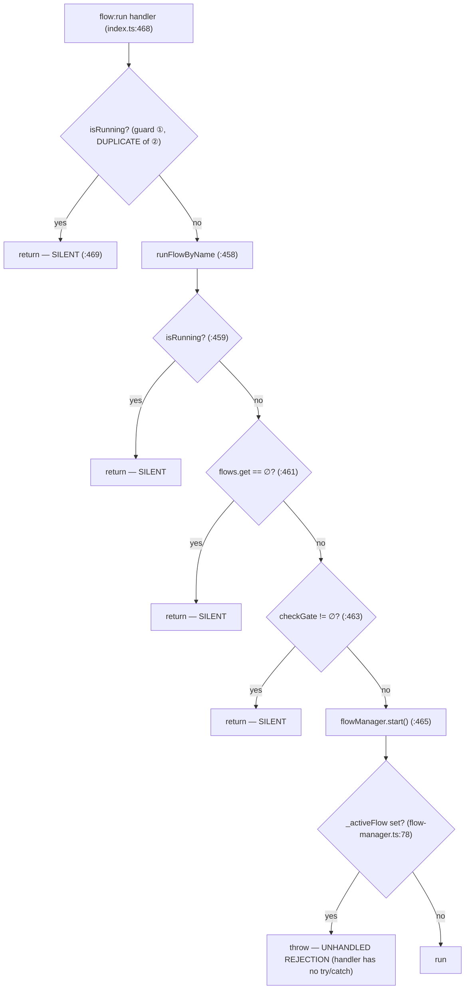
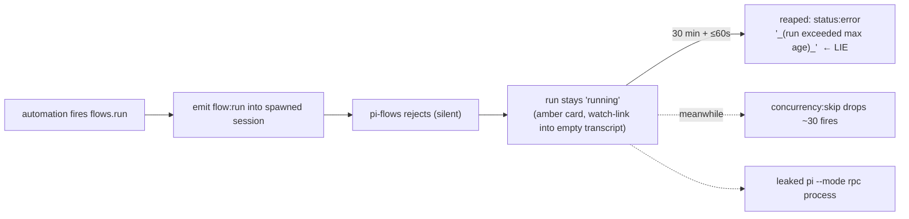

# Research — `flow:run` event surfacing, rejection observability, and run identity

> **Status:** exploratory notes, not shipped. Captures a multi-thread investigation
> across pi-flows, pi-agent-dashboard, and the pi runtime (`@earendil-works/pi-coding-agent`).
> Every claim below carries a `file:line` reference verified against the running source
> (pi-flows `0.3.4` / dashboard `private/invoicebot` / runtime `0.80.6`).
>
> **Related draft change:** `openspec/changes/report-flow-run-rejection-and-run-identity/`
> (drafted before this investigation; this note reframes it — see §7).

## 0. TL;DR

- **`flow:run` is the single programmatic entry** every host producer funnels through
  (REST dispatch, domain-package tools, dashboard automations, slash commands).
- It **declines silently on four paths** (unknown flow / already-running / gate-blocked /
  a check-to-assign **race**) and can throw a **fifth** unhandled rejection.
- A declined **automation** dispatch is a **30-minute silent wedge** that then reports the
  **lie** `"_(run exceeded max age)_"` — the real reason is provably unreachable from the
  run record.
- The drafted "emit `flow:notify` for parity" fix **does not fix that** — `flow:notify` is a
  toast channel the automation engine never finalizes on.
- **Run identity (`flowRunId`) already exists but is trapped in the persister** and never
  reaches live payloads; moving the mint to `FlowManager.start()` is clean (3 code sites +
  2 tests, zero spec retraction) and the dashboard **does not** group by it, so it can't
  conflict.
- The **coherent minimal fix** = run-id-on-payload **+** rejection emits a *terminal signal
  the completion machinery already consumes* (Option C), mostly pi-flows, at most a 3-line
  dashboard change.
- **Option A** (typed public stream) is strictly worse and blocked behind the run-id move.
- **Option B** (kill the dashboard monkey-patch) is a separate, 4th-repo effort — but the
  investigation surfaced a **real double-forward bug** worth filing regardless.

---

## 1. The decline map (pi-flows) — verified

`extensions/flow-engine/index.ts` — the `flow:run` handler and its sole callee `runFlowByName`:



Four silent returns **plus** one throw. The **command** path (`registerFlowCommand`,
`index.ts:420-433`) emits `flow:notify` (level `error`) for the unknown-flow /
already-running / gate cases; the **event** path emits nothing for any of them.
`runFlowByName` has exactly one caller and is not exported — this handler is the whole
programmatic surface.

### 1a. The `start()` race (why guard ① cannot just be deleted)

`flow-manager.ts`:

```
:78   if (this._activeFlow) throw           ← CHECK
:86   ioAdapter.onFlowStart?.()               (sync)
:90   for (obs) obs.onFlowStarted?.()         (sync)
:92   const { runFlow } = await import(...)  ◀── YIELD  (81 lines + an await after CHECK)
:159  this._activeFlow = { promise, ... }    ← ASSIGN
```

Two `flow:run` events inside that window both pass every guard → **two concurrent runs in
one process**: the second clobbers the first's `_activeFlow` (its `abortController` is now
unreachable → `flow:abort` no-ops), and when the first settles it nulls `_activeFlow` while
the second is live. Window is wide on a session's **first** flow (`await import` does real
module I/O), microtask-narrow but non-zero after. This is the **same failure mode as a
double-loaded engine**, reachable with a single correct install.

**Consequence:** any fix must (1) delete guard ①, (2) make check-to-assign atomic (mark
active before the first `await`), and (3) wrap the handler's `start()` call so the
now-reachable throw becomes observable — **all three, or it is a regression.**

---

## 2. What actually surfaces today (correcting the handoff framing)

A flow that **starts** is **not** silent. Two audiences, two different truths:

| Audience | What it observes |
|---|---|
| Dashboard **UI** (flow card, live states) | **every** `flow:*` event — forwarded by the bridge catch-all |
| Automation **run record** (running → finished) | **only** `flow_complete` (the action's declared `completion.eventType`) — plus `agent_end` / Stop / reaper / session-death |

So `flow_complete` is the *only* event that flips the automation **run** to finished; the
rest paint the card. A **rejection** emits none of those → the run never finalizes via
completion (see §4).

- Catch-all + rename: `pi-agent-dashboard/packages/extension/src/bridge.ts:1787`
  (`EVENT_BUS_MAP[channel] ?? channel`), install at `:1817`.
- Automation completion contract: `packages/flows-plugin/src/server/automation-actions.ts:144`
  (`completion: { eventType: "flow_complete", summarize: summarizeFlowResult }`).
- Completion match: `packages/automation-plugin/src/server/index.ts:246-251`
  (`event.eventType === completion.eventType`, keyed by **sessionId**).

### 2a. What `flow:notify` is

A generic **toast/message** channel — not a lifecycle or completion event.
- Producer: engine, for user-facing messages (command-path rejections, "flow deleted").
- TUI consumer: `flow-tui.ts:809` → `uiCtx.notify(message, level)`.
- Browser: forwarded by the catch-all under its **raw** name (unmapped in `FLOW_EVENT_MAP`),
  **no toast host** in the client → renders as raw JSON in a **hidden** session
  (`packages/client/src/lib/event-reducer.ts` default arm), **zero linkage to `runId`**.
- Payload: `{ message, level }`.

**Nothing consumes `flow:notify` as terminal.** Emitting it on rejection makes the message
*visible* (TUI toast) but does **not finalize** an automation run.

---

## 3. The pi runtime EventBus — why the monkey-patch exists

`@earendil-works/pi-coding-agent/dist/core/event-bus.js` (full interface):

```ts
export interface EventBus {
  emit(channel: string, data: unknown): void;
  on(channel: string, handler: (data: unknown) => void): () => void;  // named channel only
}
```

**No wildcard / `onAny`.** To forward *all* channels (incl. unknown/future ones) the bridge
has no hook but to intercept `emit` — a global mutation of a shared, long-lived bus object.
This is a symptom of a missing runtime API, and it lives entirely in the dashboard, not
pi-flows. pi-flows emitting `pi.events.emit("flow:…", data)` is correct and idiomatic.

---

## 4. The reaper — how bad the hang is (verified)

A rejected `flow:run` from an automation misses all three finalize paths (no `flow_complete`,
no `agent_end`, no session death — the spawned `pi --mode rpc` session does **not** self-exit
on `agent_end`, `engine.ts:578-580`). The only backstop is the stale-run reaper:

- `maxRunAgeMs` default **1 800 000 ms (30 min)** — `automation-plugin/src/server/index.ts:121`
  (`cfg.maxRunAgeMs ?? 30*60*1000`); `<= 0` disables it.
- `REAP_INTERVAL_MS` **60 000 ms**, hardcoded — `engine.ts:417`.
- Reap outcome: `status:"error"`, `result.md = "_(run exceeded max age)_"` — `engine.ts:355-361`.

**The terminal state is a lie by omission.** The real reason (unknown flow / gate /
already-running) is provably unreachable — capture is `turn_end`-anchored assistant text only
(`index.ts:298-303`), and no code watches for a `flow_started` ack after dispatch (grep for
`flowStartTimeout|awaitStart|dispatchTimeout` → zero hits).

**Collateral in the 30-min window:**
- `concurrency:"skip"` (default) **drops every subsequent fire** — a 1-min cron loses ~30
  fires, logged only as `[runner] skip: drop overlapping fire`.
- 🐞 The reaper's `finishAndRelease` **omits `abortSpawnedRun`** (`engine.ts:375-393`) → each
  rejection **leaks one idle `pi --mode rpc` process** for the life of the server.
- 🐞 The invoicebot **reuse** path (`invoicebot-plugin/src/server/session-link.ts:402-411`)
  creates **no run record at all** → its equivalent failure hangs **unbounded** while
  reporting success (checks only the transport boolean).



---

## 5. Run identity (`flowRunId`) — blast radius (verified)

**Minted today inside the persister**, on the `flow:flow-started` channel, stamped only on
the persisted record envelope — **never on live payloads**:

```ts
// flow-persist.ts:291
if (channel === "flow:flow-started") this.flowRunId = randomUUID();   // THE mint
// flow-persist.ts:296
flowRunId: this.flowRunId,   // envelope only
```

The live/persist ordering (`flow-tui.ts:565-568`, emit-then-persist) is exactly why a
persister-side getter can never supply the id for the first event — **minting in `start()`
dissolves this** (id pre-exists the first emit).

| | Site | file:line |
|---|---|---|
| **Producer** — the only mint | `randomUUID()` on `flow:flow-started` | `flow-persist.ts:291` |
| **Producer** — explicit injection (NOT a mint) | `persistTerminal(flowRunId, …)` | `flow-persist.ts:271,276` ← called `flow-tui.ts:763` |
| Consumer — orphan detect + idempotency | `findOrphanedRun` grouping key | `flow-persist.ts:65-85` |
| Consumer — run-state projection | `projectRuns` grouping key | `flow-persist.ts:121-167` → `flow-context/index.ts:214` |
| Consumer — type contract | `FlowEventRecord.flowRunId` | `types.ts:323` |
| **NOT a consumer** ⚠️ | dashboard replay | `state-replay.ts:57` (comment only — never extracted at `:61`, never grouped at `:198`) |

**Headline correction:** the dashboard replay **does not group by `flowRunId`** — run
separation comes from `flow-reducer.ts:100` returning a fresh `FlowState` on `flow_started`.
Unknown payload keys are ignored, no schema validation exists → a live `runId` **cannot
double-count or conflict**. Only cosmetic cost: persisted records would then carry the id
twice (envelope + `data.runId`) — pick an authoritative one in design.

**Spec impact:** none retracted. `flow-session-persistence/spec.md:35` says only "an
identifier for the originating flow run"; `run-state-exposure/spec.md` never names
`flowRunId` (abstract "identity"). Both need at most *additive* deltas; the mint site lives
only in code comments + an archived task, never in a requirement.

**The one real risk:** the orphan carve-out `persistTerminal(orphan.flowRunId, …)` must
survive **verbatim** — `activeRunId` is `null` there by construction (`flow-tui.ts:737-738`).
Unifying it onto the live handle breaks cold-resume idempotency into infinite
re-reconciliation. Regression net: `__tests__/flow-orphan-reconciliation.test.ts:90`.

**Tests that MUST change** (they lock persister-level self-mint + rotation):
`__tests__/flow-persist.test.ts:50` and `:64`.

---

## 6. The three architectural options — evidence verdicts

### Option A — a first-class typed run-event stream in pi-flows

**Drop it.** `FlowObserver` (`flow-io.ts:70-85`) is a clean 1:1 cover of the persisted core-11,
but it is **internal**: 2 implementors, **0 tests**, an undocumented **load-bearing ordering**
contract (`insertObserver` at index 0, `index.ts:211-223`), an **unguarded fan-out**
(`flow-manager.ts:90-193`, a throwing observer kills the run), and **not reachable via the
package `exports` map** (`FlowObserver` lives at `flow-engine/index.ts:59`, excluded).

It **cannot even close the seam it targets**: 4 of the 14 dashboard-mapped channels
(`flow:summary-*` ×3, `flow:autonomous-mode-changed`) come from a **different extension**
(`flow-summary/`); `flow:notify` fires when **no run exists**; and `subagents:*` + `ib:*` keep
the catch-all alive regardless. The dashboard has a **zero-import, duck-typed edge**
(`state-replay.ts:59`) — Option A would trade that for a hard cross-repo type dependency.
And it is **blocked behind the run-id move** anyway (a stream promising `{runId, kind, …}`
needs the id on live payloads first).

> If a registration seam is ever wanted, use a `flow:register-observer` **event** (matches the
> 9 existing `flow:register-*` handlers), not an exported function + FlowManager singleton.

### Option C — terminal/lifecycle taxonomy (the coherent rejection fix)

**Small, and the "correlated id" fear is a non-issue.** Automation completion is
**session-scoped** (`index.ts:251`, keyed by `sessionId`) and one session runs at most one
flow (`FlowManager` singleton + `isRunning`), so "terminal for my run" = "terminal on my
session" — **no shared run id needed**. `ActionCompletion.eventType` is a single string
(`action-registry.ts:44`) with **one production consumer**; widening it is one type field +
one `includes` line + one declaration.

Two variants:

| | mechanism | dashboard change | honesty |
|---|---|---|---|
| **C-a** | rejection emits `flow:complete` with `status:"rejected"` + reason | **none** (`flow_complete` already finalizes; `summarizeFlowResult` already reads `status`) | pollutes `flow:complete` with runs that never started; a rejected run never fired `flow:flow-started` so its persisted `flowRunId` is empty (skipped by orphan/projection — harmless but untidy) |
| **C-b** | new `flow:rejected` → `flow_rejected`; widen `ActionCompletion.eventType` → `eventTypes[]` | **3 lines** (`action-registry.ts` + `index.ts:251` + `automation-actions.ts:144`) | `flow:complete` stays honest |

Either finalizes the automation run **in seconds with the real reason** instead of a 30-min
lying wedge.

### Option B — kill the dashboard monkey-patch

**Separate effort, 4th repo.**
- **b1** (explicit `.on()` per channel) is a **capability regression**: 28/49 in-tree channels
  ride pass-through; 3 sites derive the channel name from runtime data
  (`bridge.ts:902`, `command-handler.ts:524`, `ui-modules.ts:262`); producers can be
  runtime-installed third-party packages (`subagents:*`). Non-enumerable in principle.
- **b2** (`onAny()` in the runtime) is honest and ~10 LOC (`createEventBus` owns the sole emit
  path; `EventEmitter` has no native wildcard so it needs an explicit fan-out), but lands in
  `@earendil-works/pi-coding-agent` (peer `"*"`), so it must stay a capability-detected
  fallback.
- 🐞 **Real bug found regardless of B:** the `emit`-restore is registered ~800 lines *after*
  the patch (`bridge.ts:2656-2659`); if `initBridge` throws in between (swallowed at
  `:126-142`), the wrapper leaks with no restore → the next init **double-forwards every
  event**. Highest-value local fix: register the restore immediately after install.

---

## 7. Reframing the drafted change

The draft `report-flow-run-rejection-and-run-identity` is **half coherent**:

- **runId half — sound, keep.** Mint in `start()` (co-located with the atomicity fix), thread
  to observers, stamp core-11 payloads + `FlowResult.runId`, persister records the supplied
  id, preserve `persistTerminal(orphanId)`. Low risk; dashboard can't conflict.
- **rejection half — reframe.** `flow:notify` parity is **proven insufficient** for the
  automation host (§4). Replace it with **Option C** — a terminal signal the completion
  machinery already consumes. (Keeping the TUI toast *as well* is optional belt-and-suspenders.)
- **`flow:prompt-request` — drop from scope.** Its only emit site is the **pre-run task
  prompt** (`index.ts:439`, before `start()`), so no active run exists to stamp; real
  during-run prompts use `ioAdapter.askUser` / the PromptBus, a different channel.

**Evidence-driven altitude:** neither "band-aid `flow:notify`" (incoherent) nor "full
A+B+C rethink" (A is worse, B is 4th-repo). The target is **runId-on-payload + rejection-as-
terminal-signal (C-a or C-b)** — mostly pi-flows, at most a 3-line dashboard change — which
actually fixes the operator-facing symptom.

---

## 8. Bugs to file separately (all dashboard-side, out of pi-flows scope)

1. **Double-forward on failed bridge init** — restore registered 800 lines late
   (`bridge.ts:1817` install vs `:2656` restore).
2. **Leaked `pi --mode rpc` per rejected dispatch** — reaper `finishAndRelease` omits
   `abortSpawnedRun` (`engine.ts:375-393`).
3. **Unbounded hang on the invoicebot reuse path** — no run record, reports success
   (`session-link.ts:402-411`).

---

## 9. Open decision (unresolved)

Which shape to build:

1. **runId-on-payload + C-a** — pi-flows only, zero dashboard change; accept `flow:complete`
   carrying never-started runs.
2. **runId-on-payload + C-b** — keeps `flow:complete` honest; tiny 3-line cross-repo change.
3. **Add the TUI toast too** (C + `flow:notify`) — belt-and-suspenders.
4. **File the 3 dashboard bugs** regardless.
5. **Option B** as a separate later effort (b2 preferred).

> Nothing here is committed. Coordination of any cross-repo slice (C-b, Option B, the 3 bugs)
> belongs in the aggregator initiative, never in a sub-repo change.
